# Time Complexity and Space Complexity in DSA

---

# 1. Introduction

## What is Algorithm Analysis?

Algorithm analysis is the theoretical study of the performance characteristics of algorithms. It involves predicting the resources—primarily **time** and **memory**—that an algorithm requires to solve a problem of a given size.

Think of it as a **quality control system** for code. Just as architects analyze building blueprints for structural integrity before construction, software engineers analyze algorithms for efficiency before implementation.

Algorithm analysis allows us to:
- Compare different approaches to solving the same problem
- Predict how algorithms will scale with increasing data
- Make informed decisions about which algorithm to use in specific scenarios
- Optimize existing solutions
- Understand theoretical limits of problem-solving

## Why Time Complexity Matters

Time complexity answers the fundamental question: *"How fast will this algorithm run as the input grows?"*

### Real-world Importance:
1. **User Experience**: Users expect instant responses. An algorithm that takes O(n²) might work for 100 items but become unusable for 100,000 items.

2. **Cost Optimization**: Cloud computing costs money. Inefficient algorithms require more compute time, which translates to higher cloud bills. At scale, a 10% improvement in efficiency can save millions.

3. **System Scalability**: Systems that handle millions of users (like Facebook, Google, or Netflix) simply cannot afford O(n²) algorithms on large datasets.

4. **Resource Constraints**: Mobile devices and IoT sensors have limited processing power. Efficient algorithms are essential for these environments.

5. **Competitive Advantage**: Faster algorithms mean faster features, which can be a decisive business advantage.

## Why Space Complexity Matters

Space complexity answers: *"How much memory will this algorithm consume as the input grows?"*

### Real-world Importance:
1. **Memory Limitations**: Mobile phones, embedded systems, and IoT devices have strict memory constraints. An algorithm that works on a laptop might crash on a smartphone.

2. **Caching Performance**: Memory-intensive algorithms cause cache misses, which slow down execution dramatically (caches are 10-100x faster than RAM).

3. **Concurrent Users**: Web servers handle thousands of concurrent requests. Each request consumes memory. Inefficient algorithms multiply memory usage across all users.

4. **Cost Reduction**: Memory is a cost driver in cloud computing. Less memory usage means ability to use smaller, cheaper instances.

5. **Garbage Collection Overhead**: Memory-heavy algorithms cause more frequent garbage collection cycles in languages like Java, Python, and C#, leading to unpredictable performance pauses.

## Why Interviewers Ask Complexity Questions

💡 **Interview Tip**: Complexity analysis is the single most tested topic in coding interviews, appearing in ~90% of FAANG interviews.

Interviewers evaluate complexity for several reasons:

1. **Fundamental Understanding**: It shows whether you truly understand what your code does, not just memorize solutions.

2. **Problem-Solving Maturity**: Your ability to analyze and optimize algorithms indicates your engineering maturity.

3. **Communication Skill**: Explaining complexity demonstrates your ability to articulate technical concepts clearly.

4. **Optimization Ability**: Understanding complexity is the foundation of improving algorithms.

5. **Distinguishing Factor**: Most candidates can solve problems; fewer can explain why their solution is optimal.

6. **Scalability Mindset**: Companies want engineers who think about scale, not just working solutions.

## Real-world Importance

Consider these scenarios:

**Scenario 1: Social Media Feed**
- Facebook processes millions of posts per second
- Their feed algorithm uses efficient data structures (O(log n) or O(1))
- Using O(n²) would require minutes to load feeds instead of milliseconds

**Scenario 2: E-commerce Search**
- Amazon searches billions of products
- Search algorithms use inverted indexes and B-trees (O(log n))
- A linear search (O(n)) would take seconds per query

**Scenario 3: Navigation App**
- Google Maps finds routes in milliseconds
- Uses graph algorithms with efficient structures
- Without complexity analysis, routing would be computationally impossible

**Scenario 4: Database Queries**
- Databases use B-trees (O(log n)) for indexing
- SQL queries without indexes perform full table scans (O(n))
- The difference is fractions of seconds vs. hours for large databases

---

# 2. What is Time Complexity?

## Definition

Time complexity is a function that describes the amount of time an algorithm takes to run as a function of the input size (n). It represents the number of **basic operations** the algorithm performs, expressed in terms of the input size.

More formally: If T(n) is the time complexity function of an algorithm, then T(n) = O(f(n)) means that for sufficiently large n, the algorithm's running time grows no faster than f(n).

## Running Time

The running time of an algorithm is the total time required to execute all operations. However, when discussing time complexity, we're not concerned with actual clock time but with the **number of elementary operations**.

**Key operations counted:**
- Assignments
- Arithmetic operations (+, -, *, /)
- Comparisons
- Array indexing
- Function calls
- Loop iterations
- Recursive calls

## Growth Rate

The growth rate describes how quickly the running time increases with input size. This is the most important aspect of time complexity.

Example showing different growth rates for n = 10, 100, 1000, and 10000:

| Complexity | n=10 | n=100 | n=1000 | n=10000 |
|------------|------|-------|--------|---------|
| O(1) | 1 | 1 | 1 | 1 |
| O(log n) | 3 | 7 | 10 | 13 |
| O(n) | 10 | 100 | 1000 | 10000 |
| O(n log n) | 33 | 664 | 9966 | 132877 |
| O(n²) | 100 | 10000 | 1,000,000 | 100,000,000 |
| O(n³) | 1000 | 1,000,000 | 1,000,000,000 | 10¹² |
| O(2ⁿ) | 1024 | 1.27×10³⁰ | 10³⁰¹ | 10³⁰¹⁰ |

## Input Size (n)

The input size (n) represents the amount of data the algorithm processes. This could be:
- Number of elements in an array
- Length of a string
- Number of nodes in a graph
- Number of edges in a graph
- Size of a matrix (rows × columns)

**Important**: n is relative to the problem. For sorting, n is the number of items. For graphs, n might be vertices, m edges, or both.

## Why Actual Execution Time is Ignored

### Hardware Dependence
The same algorithm runs at completely different speeds on:
- A smartphone (2 GHz ARM processor)
- A gaming PC (5 GHz x86 processor)
- A supercomputer (exascale performance)

### Programming Language Dependence
Python code is often 10-100x slower than equivalent C++ code for numeric operations.

### Implementation Dependence
Within the same language, different coding styles can affect actual runtime:
```python
# Simple but slower (Python)
result = 0
for i in range(n):
    result += i

# Using Python's built-in (faster)
result = sum(range(n))
```

### Input Data Characteristics
The same algorithm can run faster on sorted data than random data (e.g., Insertion Sort).

### Compiler/Interpreter Optimizations
Modern compilers can dramatically change performance through optimization flags.

## Hardware Independence

Time complexity provides a **machine-independent** measure of algorithm efficiency. It's expressed in terms of:
- Number of operations
- Not in milliseconds or CPU cycles

This allows us to:
1. Compare algorithms objectively
2. Predict performance on any hardware
3. Focus on algorithmic improvements, not hardware upgrades

## Programming Language Independence

Time complexity abstracts away language-specific details:
- C++ is faster than Python, but both have the same time complexity class
- The number of operations is roughly the same regardless of language
- Algorithms with lower complexity will be faster in every language

**Example**: Linear Search is O(n) in both:
```python
# Python O(n)
def linear_search(arr, target):
    for i in range(len(arr)):
        if arr[i] == target:
            return i
    return -1
```

```cpp
// C++ O(n)
int linear_search(int arr[], int n, int target) {
    for (int i = 0; i < n; i++) {
        if (arr[i] == target) return i;
    }
    return -1;
}
```

## Practical Examples

### Example 1: Simple Statement
```python
def simple(a, b):
    sum = a + b          # 1 operation
    return sum           # 1 operation
```
**Time Complexity**: O(1) - constant time

### Example 2: Single Loop
```python
def sum_array(arr):
    total = 0            # 1 operation
    for x in arr:        # n iterations
        total += x       # 1 operation per iteration
    return total         # 1 operation
```
**Time Complexity**: O(n) - linear time
**Operation count**: O(1 + n + 1) = O(n)

### Example 3: Nested Loops
```python
def print_pairs(arr):
    for i in range(len(arr)):      # n iterations
        for j in range(len(arr)):  # n iterations each time
            print(arr[i], arr[j])  # 1 operation
```
**Time Complexity**: O(n²) - quadratic time
**Operation count**: n × n = n²

### Example 4: Recursive
```python
def factorial(n):
    if n <= 1:           # 1 comparison
        return 1
    return n * factorial(n-1)  # recursive call
```
**Time Complexity**: O(n) - linear time
**Operation count**: n function calls

---

# 3. What is Space Complexity?

Space complexity refers to the amount of memory an algorithm uses as a function of the input size. It includes all memory required to execute the algorithm.

## Auxiliary Space

**Auxiliary space** is the extra space or temporary space used by an algorithm during its execution, excluding the input data.

**Examples**:
- Temporary variables
- Arrays allocated for intermediate results
- Recursion stack space
- Cache/staging structures

```python
def find_duplicates(arr):
    temp = []              # Auxiliary space: O(n)
    seen = set()          # Auxiliary space: O(n)
    
    for x in arr:
        if x in seen:
            temp.append(x)
        seen.add(x)
    return temp

# Auxiliary Space: O(n) (for temp and seen)
# Total Space: O(n) (same as input)
```

## Total Space

**Total space** = Input space + Auxiliary space

```
Total Space = Space for Input + Space for Algorithm (auxiliary)
```

For example:
- Input array of n integers: O(n) space
- Algorithm uses O(1) auxiliary space
- Total space: O(n)

## Input Space

Input space is the memory required to store the input data itself. This includes:
- Arrays and their elements
- Strings and their characters
- Graph adjacency matrices or lists
- Tree nodes and pointers

**Note**: In complexity analysis, we often focus on auxiliary space because input space is unavoidable and given.

## Memory Usage

### Stack Memory
- Stores function call information
- Local variables
- Return addresses
- Function parameters

**Stack memory characteristics**:
- Fast allocation/deallocation (LIFO)
- Limited size (typically 1-8 MB)
- Automatically managed
- Used for non-recursive code and recursion

**Example stack usage**:
```python
def recursive_sum(n):
    if n <= 0:
        return 0
    return n + recursive_sum(n-1)  # Stack grows with n

# Space: O(n) on stack for n function calls
```

### Heap Memory
- Dynamic memory allocation
- Objects and data structures
- Manually managed in some languages, garbage-collected in others

**Heap characteristics**:
- Slower allocation/deallocation
- Large capacity
- Needs explicit management or garbage collection
- Used for dynamic data structures

**Example heap usage**:
```python
def create_large_array(n):
    arr = [0] * n        # Heap allocation
    return arr

# Space: O(n) on heap
```

## Stack Memory vs Heap Memory

| Aspect | Stack | Heap |
|--------|-------|------|
| Allocation Speed | Fast | Slow |
| Size | Small (KB-MB) | Large (GB) |
| Management | Automatic | Manual/GC |
| Access Speed | Fast | Slower |
| Recursion | Uses stack | Generally not |
| Data Lifetime | Function scope | As needed |
| Example | Local variables | Lists, objects |

## Practical Examples

### Example 1: O(1) Space - In-place Algorithms
```python
def reverse_array(arr):
    left = 0                 # Auxiliary: 2 variables
    right = len(arr) - 1
    
    while left < right:
        arr[left], arr[right] = arr[right], arr[left]  # Swap in-place
        left += 1
        right -= 1
    
    return arr

# Input: O(n) (the array)
# Auxiliary: O(1) (two variables)
# Total: O(n)
```

### Example 2: O(n) Space - Copying Input
```python
def square_array(arr):
    result = [0] * len(arr)  # Auxiliary array: O(n)
    for i in range(len(arr)):
        result[i] = arr[i] * arr[i]
    return result

# Input: O(n)
# Auxiliary: O(n) (result array)
# Total: O(n)
```

### Example 3: O(n²) Space - Matrix Operations
```python
def multiply_matrices(A, B):
    n = len(A)
    result = [[0] * n for _ in range(n)]  # Auxiliary: O(n²)
    
    for i in range(n):
        for j in range(n):
            sum = 0
            for k in range(n):
                sum += A[i][k] * B[k][j]
            result[i][j] = sum
    
    return result

# Input: O(n²) (two matrices)
# Auxiliary: O(n²) (result matrix)
# Total: O(n²)
```

### Example 4: Recursion Space
```python
def binary_search_recursive(arr, target, left, right):
    if left > right:
        return -1
    
    mid = (left + right) // 2
    
    if arr[mid] == target:
        return mid
    elif arr[mid] < target:
        return binary_search_recursive(arr, target, mid + 1, right)
    else:
        return binary_search_recursive(arr, target, left, mid - 1)

# Space: O(log n) for recursion stack
# This is because at each call, the array size halves
```

### Example 5: Variable Space Usage
```python
def complex_operation(n):
    # O(1) space
    if n <= 0:
        return 0
    
    # O(n) space - temporary list
    temp1 = [i for i in range(n)]  # O(n)
    
    # O(n/2) space - simplified to O(n)
    temp2 = [j for j in range(n//2)]  # O(n)
    
    # O(1) space
    result = 0
    for x in temp1:
        result += x
    
    return result

# Total auxiliary space: O(n) + O(n) + O(1) = O(n)
```

---

# 4. Asymptotic Analysis

Asymptotic analysis is the method of describing the limiting behavior of an algorithm as the input size approaches infinity. It focuses on the growth rate rather than exact operation counts.

## Big O (Worst Case)

### Definition
Big O describes the **upper bound** of an algorithm's growth rate. It represents the worst-case scenario or the maximum time/space an algorithm could need.

**Formal Definition**: f(n) = O(g(n)) if there exist positive constants c and n₀ such that:
```
0 ≤ f(n) ≤ c·g(n) for all n ≥ n₀
```

**Intuition**: "f(n) grows no faster than g(n) up to a constant factor."

### Formula
For an algorithm with time complexity T(n), we say T(n) = O(f(n)) if:
```
lim sup (T(n) / f(n)) < ∞ as n → ∞
```

### Examples

1. **O(1) - Constant Time**
   - Accessing array element by index
   - Simple arithmetic operations
   - Hash table lookup

2. **O(n) - Linear Time**
   - Finding maximum in unsorted array
   - Linear search
   - Sum of array elements

3. **O(n²) - Quadratic Time**
   - Bubble sort
   - Nested loops iterating over all pairs

4. **O(log n) - Logarithmic Time**
   - Binary search
   - Operations on balanced BST
   - Finding highest power of 2 ≤ n

### Graph Intuition

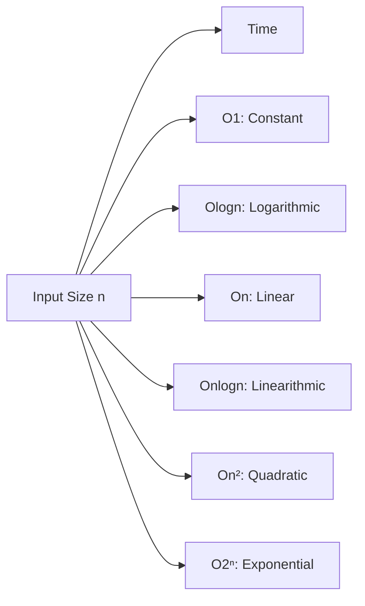

### Interview Questions

**Q1: What is the time complexity of accessing an element in an array?**
- O(1) - Direct memory access

**Q2: What is the time complexity of searching in a balanced BST?**
- O(log n) - Height of BST is log n

**Q3: Is O(2n) = O(n)?**
- Yes, constants are ignored

**Q4: What is the worst-case time complexity of QuickSort?**
- O(n²) when pivot is poorly chosen

## Omega (Best Case)

### Definition
Omega describes the **lower bound** of an algorithm's growth rate. It represents the best-case scenario.

**Formal Definition**: f(n) = Ω(g(n)) if there exist positive constants c and n₀ such that:
```
0 ≤ c·g(n) ≤ f(n) for all n ≥ n₀
```

### Examples

1. **Linear Search**
   - Ω(1) - Found at first position

2. **Bubble Sort**
   - Ω(n) - Already sorted array

3. **Binary Search**
   - Ω(1) - Found at middle

4. **QuickSort**
   - Ω(n log n) - Balanced partitioning every time

### Important Note
While Ω is mathematically interesting, interviewers rarely ask for best-case analysis. Focus on worst-case (Big O) and average-case (Theta).

## Theta (Average/Tight Bound)

### Definition
Theta describes the **tight bound** - when the upper and lower bounds match.

**Formal Definition**: f(n) = Θ(g(n)) if there exist positive constants c₁, c₂, and n₀ such that:
```
c₁·g(n) ≤ f(n) ≤ c₂·g(n) for all n ≥ n₀
```

### Examples

1. **Linear Search**
   - Θ(n) - On average, check half the elements

2. **Merge Sort**
   - Θ(n log n) - Always divides and conquers

3. **Binary Search**
   - Θ(log n) - Always halves the search space

4. **Array Access**
   - Θ(1) - Direct indexing

## Difference Between Big O, Omega, Theta

| Aspect | Big O (Worst) | Omega (Best) | Theta (Average/Tight) |
|--------|--------------|--------------|----------------------|
| Bound | Upper | Lower | Tight |
| Scenario | Worst-case | Best-case | Average-case |
| Usage | Most common | Less common | Common |
| Expression | f(n) ≤ c·g(n) | f(n) ≥ c·g(n) | c₁·g(n) ≤ f(n) ≤ c₂·g(n) |
| Interview | High priority | Low priority | Medium priority |

**Table Representation:**

| Algorithm | Best (Ω) | Average (Θ) | Worst (O) |
|-----------|----------|-------------|-----------|
| Linear Search | Ω(1) | Θ(n) | O(n) |
| Binary Search | Ω(1) | Θ(log n) | O(log n) |
| Bubble Sort | Ω(n) | Θ(n²) | O(n²) |
| QuickSort | Ω(n log n) | Θ(n log n) | O(n²) |
| Merge Sort | Ω(n log n) | Θ(n log n) | O(n log n) |
| Hash Table Search | Ω(1) | Θ(1) | O(n) |

**Visual Representation**:
```text
Asymptotic Notations

Big O (Upper Bound)
f(n) ≤ c · g(n)

Theta (Tight Bound)
c₁ · g(n) ≤ f(n) ≤ c₂ · g(n)

Omega (Lower Bound)
f(n) ≥ c · g(n)


                 f(n)
                  ↑
                  │
        Big O     │──────────────────────────
                  │
        Theta     │══════════════════════════
                  │
        Omega     │__________________________
                  │
                  └──────────────────────────→ n
                         g(n)
```

# 5. Growth of Functions

## O(1) - Constant Time

### Definition
An algorithm has O(1) time complexity when it performs a fixed number of operations regardless of input size. The execution time is constant and independent of n.

### Visualization
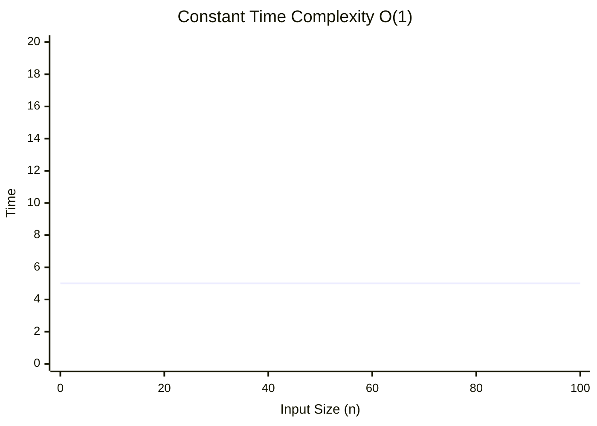

### Real-life Analogy
**Reading a book's first page**: No matter how thick the book is, opening to page 1 and reading it takes the same time.

### Example Algorithms
- Accessing array element by index
- Hash table insertion/lookup
- Push/pop on stack
- Enqueue/dequeue from queue
- Simple arithmetic operations
- Conditional checks

### Python Code Example
```python
def get_first_element(arr):
    if not arr:                    # O(1)
        return None
    return arr[0]                  # O(1)

# Time: O(1) - Two operations regardless of array size

def constant_time(n):
    sum = 0
    for i in range(10):            # Constant iterations (10)
        sum += i
    return sum * n                 # O(1) - multiplication is constant

# Even though loop exists, it runs fixed 10 times
```

### Dry Run
```python
arr = [1, 2, 3, 4, 5, 6, 7, 8, 9, 10]  # n = 10
# Operations: 2 (check + return)

arr = [1, 2, 3, ..., 1000000]  # n = 1,000,000
# Operations: 2 (check + return)  ← Still constant!
```

### Graph Explanation
```
Time complexity is flat horizontal line at y = c (constant)
```

### Advantages
- Fastest possible time complexity
- Predictable execution time
- Scales perfectly with input size

### Disadvantages
- Not always achievable
- May require precomputation or preprocessing
- May use more memory

### Interview Importance
⭐⭐⭐⭐⭐ **Extremely Important**
- Almost every interview has O(1) operations
- Hash tables are interview favorites
- Space-time tradeoffs often aim for O(1)

💡 **Interview Tip**: Look for O(1) solutions using hash maps or arrays. They're often the expected optimal solution.

⚠️ **Common Mistake**: Don't claim O(1) for loops that depend on n. If a loop runs n times, it's O(n).

---

## O(log n) - Logarithmic Time

### Definition
An algorithm has O(log n) time complexity when the problem size is reduced by a constant factor at each step. The running time grows proportionally to the logarithm of the input size.

### Visualization
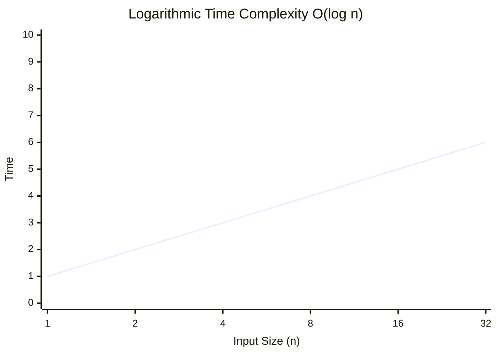

### Real-life Analogy
**Finding a word in a dictionary**: You don't check every word. You open the middle, decide which half contains your word, and repeat.

### Example Algorithms
- Binary search
- Operations on balanced BST
- Finding height of balanced tree
- Exponentiation (fast power)
- Euclidean algorithm (GCD)

### Python Code Example
```python
def binary_search(arr, target):
    left, right = 0, len(arr) - 1
    
    while left <= right:
        mid = (left + right) // 2
        
        if arr[mid] == target:
            return mid
        elif arr[mid] < target:
            left = mid + 1
        else:
            right = mid - 1
    
    return -1

# For each iteration, search space halves: n → n/2 → n/4 → ... → 1
# Number of iterations = log₂(n)
# Time: O(log n)

def power(base, exp):
    result = 1
    while exp > 0:
        if exp & 1:              # If exp is odd
            result *= base
        base *= base
        exp >>= 1                # Divide exp by 2
    return result

# Each iteration halves exponent: exp → exp/2
# Time: O(log exp)
```

### Dry Run
```
Binary Search on array of size 16:
n = 16 → check mid → n = 8
n = 8  → check mid → n = 4
n = 4  → check mid → n = 2
n = 2  → check mid → n = 1

Steps = 4 = log₂(16)
```

### Graph Explanation
```
The curve rises quickly initially but then flattens
Significant improvement over linear time for large n
```

### Advantages
- Very efficient for large datasets
- Standard for search operations
- Predictable performance

### Disadvantages
- Requires data to be sorted (for binary search)
- May need balanced data structures
- Slightly more complex to implement

### Interview Importance
⭐⭐⭐⭐⭐ **Extremely Important**
- Binary search is a fundamental algorithm
- Tree-based data structures are core to interviews
- Many optimization techniques involve log n

💡 **Interview Tip**: If you see O(log n), think "divide and conquer" or "binary search."

⚠️ **Common Mistake**: Confusing O(log n) with O(log₂ n). The base of the logarithm doesn't matter for Big O notation.

---

## O(√n) - Square Root Time

### Definition
An algorithm has O(√n) time complexity when the number of operations is proportional to the square root of the input size.

### Visualization
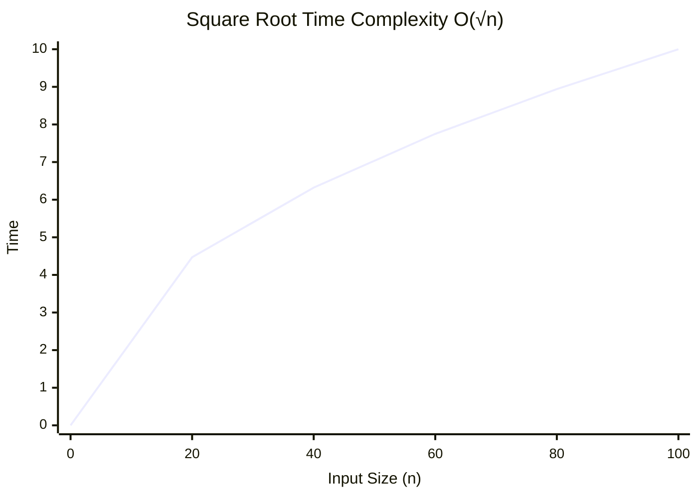

### Comparison Table

| n | √n |
|---|---:|
| 1 | 1 |
| 10 | 3.16 |
| 100 | 10 |
| 1000 | 31.62 |
| 10000 | 100 |
| 100000 | 316.23 |

### Real-life Analogy
Imagine you are checking a long list of possible factor pairs for a number. Instead of scanning all the way to $n$, you only need to look up to $n$ because any factor larger than $n$ must already have a matching smaller factor.

### Where √n Appears in Algorithms
- Prime checking: you only need to test divisors up to $n$
- Finding divisors or factor pairs
- Number theory problems that can be reduced by pairing values
- Certain optimized search techniques where the search space shrinks by a square root

### Python Code Example
```python
def is_prime(n):
    if n < 2:
        return False
    if n == 2:
        return True
    if n % 2 == 0:
        return False

    i = 3
    while i * i <= n:          # √n iterations
        if n % i == 0:
            return False
        i += 2

    return True

# Example: is_prime(1000003) checks only about 1000 values
# Time: O(√n)
```

```python
def count_divisors(n):
    count = 0
    i = 1
    while i * i <= n:
        if n % i == 0:
            if i == n // i:
                count += 1
            else:
                count += 2
        i += 1
    return count

# Time: O(√n)
```

### Dry Run
```python
# Prime check for n = 100
# We stop once i*i > n

i = 3: 3² = 9 ≤ 100 → check 3
i = 5: 5² = 25 ≤ 100 → check 5
i = 7: 7² = 49 ≤ 100 → check 7
i = 9: 9² = 81 ≤ 100 → check 9
i = 11: 11² = 121 > 100 → stop

Only 5 checks are needed instead of 100.
```

### Advantages
- Significant improvement over O(n)
- Simple to implement
- Effective for number theory problems

### Disadvantages
- Less common in data structure operations
- May not always be the optimal solution

### Interview Importance
⭐⭐⭐ **Moderately Important**
- Appears in math-related problems
- Useful optimization technique for prime checking
- Sometimes appears in two-pointer problems

💡 **Interview Tip**: If a problem involves factors, divisors, or primes, consider O(√n) solutions.

---

## O(n) - Linear Time

### Definition
An algorithm has O(n) time complexity when the number of operations grows linearly with the input size. Each element in the input is processed exactly once (or a constant number of times).

### Visualization
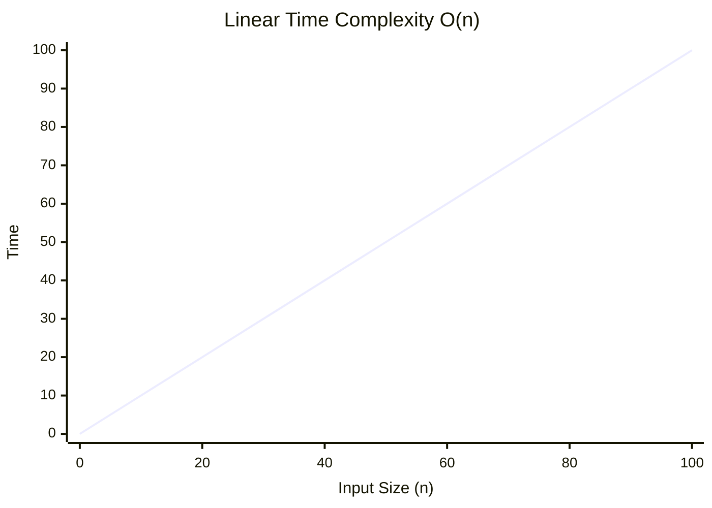

### Real-life Analogy
**Reading a book**: You must read every page to finish the book. Reading 100 pages takes 100 times longer than reading 1 page.

### Example Algorithms
- Linear search
- Finding max/min
- Array traversal
- String matching (simple)
- Counting occurrences
- Reversal of array/list
- Copying data

### Python Code Example
```python
def find_max(arr):
    if not arr:                  # O(1)
        return None
    
    max_val = arr[0]             # O(1)
    for num in arr:              # n iterations
        if num > max_val:
            max_val = num
    return max_val

# Each element visited once: O(n)

def has_duplicates(arr):
    seen = set()                 # O(1)
    for x in arr:                # n iterations
        if x in seen:            # O(1) on average
            return True
        seen.add(x)              # O(1) on average
    return False

# Each element processed once: O(n)

def string_reverse(s):
    # Pythonic way - internally O(n)
    return s[::-1]

# All characters processed once: O(n)
```

### Dry Run
```python
arr = [3, 7, 2, 9, 5]  # n = 5

# Operations:
# 1. Initialize max_val = arr[0]
# 2. Check arr[1] = 7 → max = 7
# 3. Check arr[2] = 2 → no change
# 4. Check arr[3] = 9 → max = 9
# 5. Check arr[4] = 5 → no change

# Total operations: 5 + 2 = O(5) = O(n)
```

### Graph Explanation
```
The graph is a straight line with slope 1
Every additional element adds constant time
```

### Advantages
- Simple and intuitive
- Works well for moderate n
- Often the baseline solution

### Disadvantages
- Doesn't scale well for huge n
- May not be optimal for large datasets
- Can be improved with better algorithms

### Interview Importance
⭐⭐⭐⭐⭐ **Extremely Important**
- The most common complexity in practice
- Often the minimum complexity for processing data
- Required as a baseline before optimization

💡 **Interview Tip**: Look for O(n) solutions first, then optimize further.

⚠️ **Common Mistake**: Forgetting that O(n) algorithms may still be too slow for very large inputs (e.g., n = 10⁹).

---

## O(n log n) - Linearithmic Time

### Definition
An algorithm has O(n log n) time complexity when it performs a log n operation for each element in the input. It's a combination of linear and logarithmic behaviors.

### Visualization


### Real-life Analogy
**Arranging books on shelves**: For each book, you do a log n search to find its spot.

### Example Algorithms
- Merge sort
- Heap sort
- Quick sort (average case)
- Most efficient comparison sorts
- Building a balanced BST from array
- Certain divide-and-conquer algorithms

### Python Code Example
```python
def merge_sort(arr):
    if len(arr) <= 1:
        return arr
    
    mid = len(arr) // 2
    left = merge_sort(arr[:mid])    # O(n/2) + recursion
    right = merge_sort(arr[mid:])   # O(n/2) + recursion
    
    return merge(left, right)       # O(n)

# Recurrence: T(n) = 2T(n/2) + O(n)
# Time: O(n log n)

def merge(left, right):
    result = []
    i = j = 0
    
    while i < len(left) and j < len(right):
        if left[i] < right[j]:
            result.append(left[i])
            i += 1
        else:
            result.append(right[j])
            j += 1
    
    result.extend(left[i:])
    result.extend(right[j:])
    return result

# Each element processed once per level
# Number of levels = log n
# Total processing per level = n
# Total time = O(n log n)
```

### Dry Run
```
Merge Sort on [4, 3, 6, 2, 5, 1]:

Level 0: [4,3,6,2,5,1]     (n=6)
         ↓ split
Level 1: [4,3,6] [2,5,1]   (n=6)
         ↓ split
Level 2: [4] [3,6] [2] [5,1]  (n=6)
         ↓ merge
Level 3: [3,4,6] [1,2,5]   (n=6)
         ↓ merge
Level 4: [1,2,3,4,5,6]     (n=6)

Number of levels = log₂(6) ≈ 3
Work per level = 6
Total work ≈ 6 × 3 = 18 = O(n log n)
```

### Graph Explanation
```
Grows slightly faster than linear
For n=1,000,000: O(n) = 1,000,000, O(n log n) ≈ 20,000,000
Still manageable for most practical purposes
```

### Advantages
- Most efficient for comparison-based sorting
- Good balance of speed and simplicity
- Standard for many algorithms
- Scale well for large datasets

### Disadvantages
- More complex than O(n) algorithms
- May require extra space (for merge sort)
- Not as fast as O(n) for small n

### Interview Importance
⭐⭐⭐⭐⭐ **Extremely Important**
- Sorting algorithms are interview staples
- Many algorithmic problems reduce to n log n
- Lower bound for comparison-based sorting

💡 **Interview Tip**: If an O(n²) solution is too slow, O(n log n) is often the next step.

⚠️ **Common Mistake**: Overcomplicating when O(n log n) isn't needed. Use it only when necessary.

---

## O(n²) - Quadratic Time

### Definition
An algorithm has O(n²) time complexity when the number of operations grows proportionally to the square of the input size. This typically occurs when iterating over all pairs of elements.

### Visualization
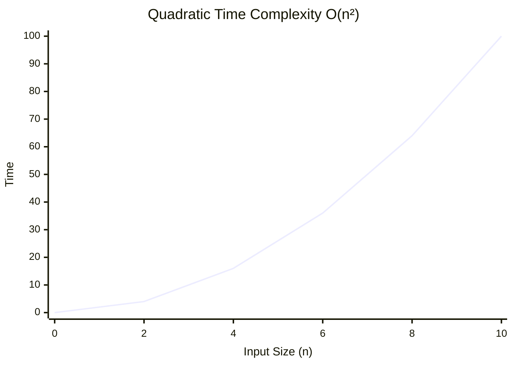

### Real-life Analogy
**Comparing everyone in a room**: Each person must shake hands with every other person. 100 people = 4,950 handshakes, but 200 people = 19,900 handshakes.

### Example Algorithms
- Bubble sort
- Selection sort
- Insertion sort
- Checking all pairs
- Matrix multiplication (naive)
- Finding duplicates with nested loops

### Python Code Example
```python
def bubble_sort(arr):
    n = len(arr)
    for i in range(n):
        for j in range(n - i - 1):
            if arr[j] > arr[j + 1]:
                arr[j], arr[j + 1] = arr[j + 1], arr[j]
    return arr

# Inner loop runs (n + (n-1) + ... + 1) = n(n+1)/2 ≈ n²
# Time: O(n²)

def find_duplicates(arr):
    n = len(arr)
    for i in range(n):
        for j in range(i + 1, n):
            if arr[i] == arr[j]:
                return True
    return False

# Checks every pair: n(n-1)/2 pairs
# Time: O(n²)

def find_pairs_sum(arr, target):
    n = len(arr)
    pairs = []
    for i in range(n):
        for j in range(i + 1, n):
            if arr[i] + arr[j] == target:
                pairs.append((arr[i], arr[j]))
    return pairs

# n(n-1)/2 pairs checked
# Time: O(n²)
```

### Dry Run
```python
arr = [1, 2, 3, 4]  # n = 4

# Bubble Sort passes:
i=0: j=0,1,2 → 3 comparisons
i=1: j=0,1 → 2 comparisons
i=2: j=0 → 1 comparison
i=3: j=0 → 0 comparisons

Total comparisons = 3+2+1+0 = 6 = 4×3/2 = 6
For n=4: n(n-1)/2 = 6
For n=100: 4950 ≈ O(10,000)
```

### Graph Explanation
```
Curve increases dramatically
n=10 → 100 operations
n=100 → 10,000 operations
n=1000 → 1,000,000 operations
Becomes unusable for n > 10,000
```

### Advantages
- Simple to understand and implement
- Effective for small inputs
- Good for educational purposes

### Disadvantages
- Poor scalability
- Becomes unusable for n > 10,000-100,000
- Often easily improvable

### Interview Importance
⭐⭐⭐⭐ **Important**
- Often the first solution you'll think of
- Need to know when it's unacceptable
- Sometimes optimal for specific problems

💡 **Interview Tip**: Mention O(n²) as a baseline, then optimize to O(n log n) or O(n).

⚠️ **Common Mistake**: Using O(n²) when O(n log n) is possible. Always check if nested loops are necessary.

---

## O(n³) - Cubic Time

### Definition
An algorithm has O(n³) time complexity when the number of operations grows proportionally to the cube of the input size. This occurs with three nested loops or matrix operations.

### Visualization
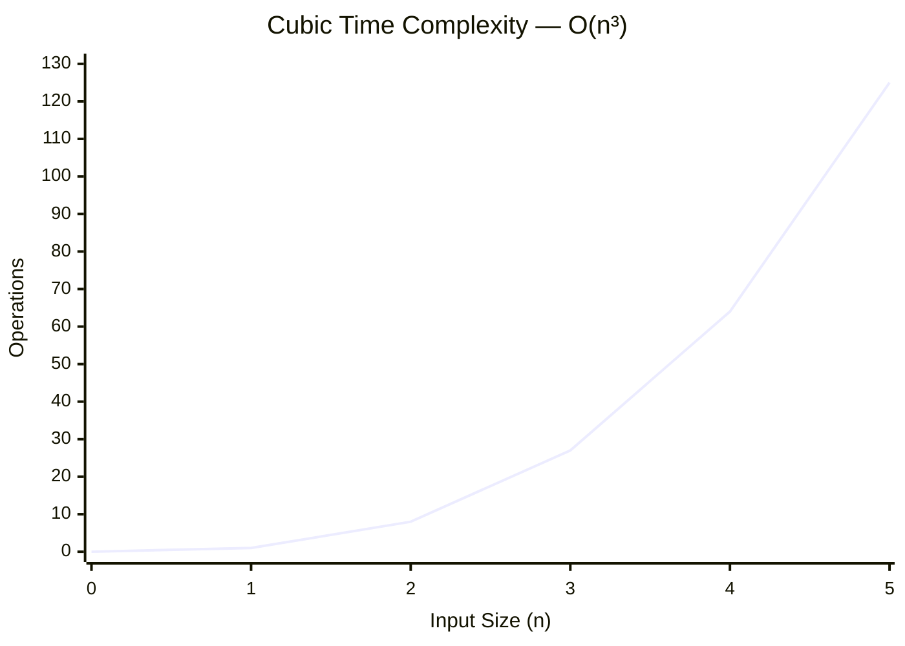

### Real-life Analogy
**Coordinating multiple teams**: If 3 teams need to coordinate with each other, the complexity grows cubically.

### Example Algorithms
- Floyd-Warshall algorithm
- Matrix multiplication (naive)
- All-pairs shortest paths
- Certain graph algorithms

### Python Code Example
```python
def matrix_multiply(A, B):
    n = len(A)
    result = [[0] * n for _ in range(n)]
    
    for i in range(n):
        for j in range(n):
            sum = 0
            for k in range(n):
                sum += A[i][k] * B[k][j]
            result[i][j] = sum
    
    return result

# Three nested loops: n × n × n = n³
# Time: O(n³)

def floyd_warshall(graph):
    n = len(graph)
    dist = [[float('inf')] * n for _ in range(n)]
    
    # Initialize distances
    for i in range(n):
        for j in range(n):
            if i == j:
                dist[i][j] = 0
            elif graph[i][j] != 0:
                dist[i][j] = graph[i][j]
    
    # Floyd-Warshall
    for k in range(n):
        for i in range(n):
            for j in range(n):
                if dist[i][k] + dist[k][j] < dist[i][j]:
                    dist[i][j] = dist[i][k] + dist[k][j]
    
    return dist

# Three nested loops: O(n³)
```

### Dry Run
```python
# Matrix multiplication: n = 3
# i = 0,1,2 (3 iterations)
#   j = 0,1,2 (3 iterations for each i)
#     k = 0,1,2 (3 iterations for each j)

Total operations = 3 × 3 × 3 = 27 = 3³

# For n=100: 1,000,000 operations
# For n=1000: 1,000,000,000 operations
```

### Advantages
- Sometimes necessary for certain problems
- Clear relationship between loops and complexity

### Disadvantages
- Often too slow for practical use
- Usually improvable with better algorithms
- Only viable for very small n

### Interview Importance
⭐⭐ **Less Important**
- Rarely the optimal solution
- Usually indicates need for optimization
- May appear as a baseline

💡 **Interview Tip**: If your solution is O(n³), immediately look for ways to improve it.

---

## O(2ⁿ) - Exponential Time

### Definition
An algorithm has O(2ⁿ) time complexity when the running time doubles with every additional input element. This is extremely inefficient and only feasible for small n.

### Visualization


### Real-life Analogy
**Finding all possible coin combinations**: Each additional coin doubles the possibilities.

### Example Algorithms
- Subset generation
- Recursive Fibonacci (naive)
- Tower of Hanoi
- Backtracking solutions
- Brute force TSP

### Python Code Example
```python
def fibonacci_recursive(n):
    if n <= 1:
        return n
    return fibonacci_recursive(n-1) + fibonacci_recursive(n-2)

# Recurrence: T(n) = T(n-1) + T(n-2) + 1
# Time: O(2ⁿ)

def generate_subsets(arr):
    n = len(arr)
    subsets = [[]]
    
    for num in arr:
        # Double the number of subsets each iteration
        new_subsets = []
        for subset in subsets:
            new_subsets.append(subset + [num])
        subsets.extend(new_subsets)
    
    return subsets

# Total subsets = 2ⁿ
# Time: O(2ⁿ)

def tower_of_hanoi(n, source, target, auxiliary):
    if n == 1:
        # Move disk
        return
    tower_of_hanoi(n-1, source, auxiliary, target)
    # Move disk
    tower_of_hanoi(n-1, auxiliary, target, source)

# Number of moves = 2ⁿ - 1
# Time: O(2ⁿ)
```

### Dry Run
```python
# Fibonacci for n=4:
fib(4) = fib(3) + fib(2)
fib(3) = fib(2) + fib(1)
fib(2) = fib(1) + fib(0)

Total calls: 
fib(4): 1
fib(3): 1, fib(2): 1
fib(2): 1, fib(1): 1, fib(1): 1, fib(0): 1
Total = 9 ≈ 2⁴

# n=10: ~1024 calls
# n=50: ~1.1e15 calls → impossible
```

### Advantages
- Sometimes the only solution for NP-hard problems
- Simple to implement
- Works for small n

### Disadvantages
- Extremely inefficient
- Only useful for n < 30
- Usually indicates need for optimization

### Interview Importance
⭐⭐⭐ **Moderately Important**
- Recognize to avoid
- Know when it's unacceptable
- Sometimes the only option for NP-hard problems

💡 **Interview Tip**: If you see exponential time, consider dynamic programming or greedy alternatives.

⚠️ **Common Mistake**: Using exponential algorithms when polynomial solutions exist.

---

## O(n!) - Factorial Time

### Definition
An algorithm has O(n!) time complexity when the running time grows factorially with the input size. This is worse than exponential and is the slowest practical complexity.

### Visualization
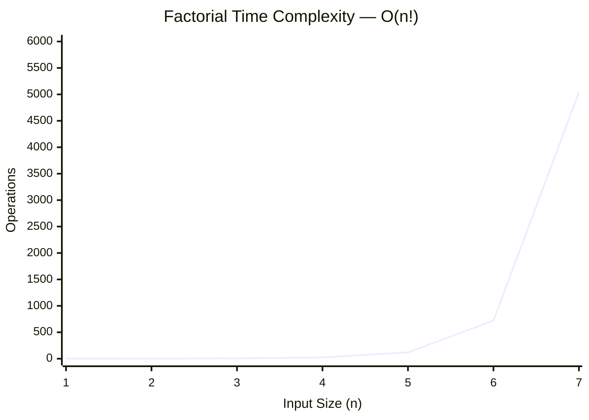

### Real-life Analogy
**Seating arrangements**: For n people, there are n! ways to arrange them around a table.

### Example Algorithms
- Generating all permutations
- Traveling Salesman Problem (brute force)
- Solving n-queens (naive)
- Generating all possible sequences

### Python Code Example
```python
def generate_permutations(arr):
    if len(arr) == 0:
        return [[]]
    
    result = []
    for i in range(len(arr)):
        # Remove current element
        remaining = arr[:i] + arr[i+1:]
        # Generate permutations of remaining
        for perm in generate_permutations(remaining):
            result.append([arr[i]] + perm)
    
    return result

# Number of permutations = n!
# Time: O(n!)

def factorial_recursive(n):
    if n <= 1:
        return 1
    return n * factorial_recursive(n-1)

# Recurrence: T(n) = T(n-1) + 1
# Time: O(n) for factorial itself
# But generating n! permutations is O(n!)
```

### Dry Run
```python
# Permutations for [1,2,3]:
First element can be 1, 2, or 3 (3 choices)
For each choice, remaining 2 elements have 2! arrangements
Total = 3 × 2 × 1 = 6 = 3!

# For n=10: 10! = 3,628,800 permutations
# For n=20: 20! = 2.43 × 10¹⁸ → impossible
```

### Advantages
- Exact solution for certain problems
- Theoretically optimal for NP-hard problems

### Disadvantages
- Only useful for n < 10
- Completely impractical for real-world use
- Often requires heuristics or approximation

### Interview Importance
⭐⭐ **Less Important**
- Recognize to avoid
- Know it exists for theory
- Mention NP-hard problems

💡 **Interview Tip**: Mention O(n!) as proof that brute force is infeasible and you need a better approach.

⚠️ **Common Mistake**: Even considering factorial algorithms for n > 10.

---

# 6. Complexity Comparison Table

## Complete Complexity Comparison

| Complexity | Name | n=10 | n=100 | n=1000 | n=1M | Scalability |
|------------|------|------|-------|--------|------|-------------|
| O(1) | Constant | 1 | 1 | 1 | 1 | ⭐⭐⭐⭐⭐ |
| O(log n) | Logarithmic | 3 | 7 | 10 | 20 | ⭐⭐⭐⭐⭐ |
| O(√n) | Square Root | 3 | 10 | 32 | 1000 | ⭐⭐⭐⭐ |
| O(n) | Linear | 10 | 100 | 1000 | 1M | ⭐⭐⭐⭐ |
| O(n log n) | Linearithmic | 33 | 664 | 9966 | 20M | ⭐⭐⭐ |
| O(n²) | Quadratic | 100 | 10K | 1M | 10¹² | ⭐⭐ |
| O(n³) | Cubic | 1000 | 1M | 1B | 10¹⁸ | ⭐ |
| O(2ⁿ) | Exponential | 1024 | 1.27×10³⁰ | 10³⁰¹ | ∞ | ❌ |
| O(n!) | Factorial | 3.6M | 9.3×10¹⁵⁷ | ∞ | ∞ | ❌ |

## Visual Performance Comparison

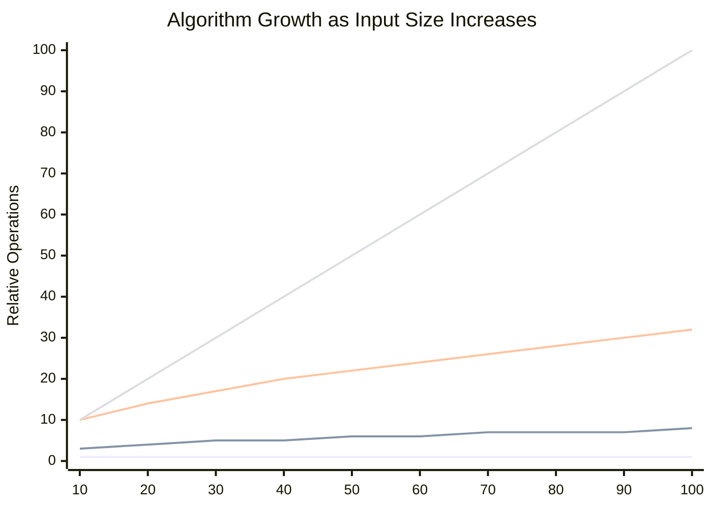

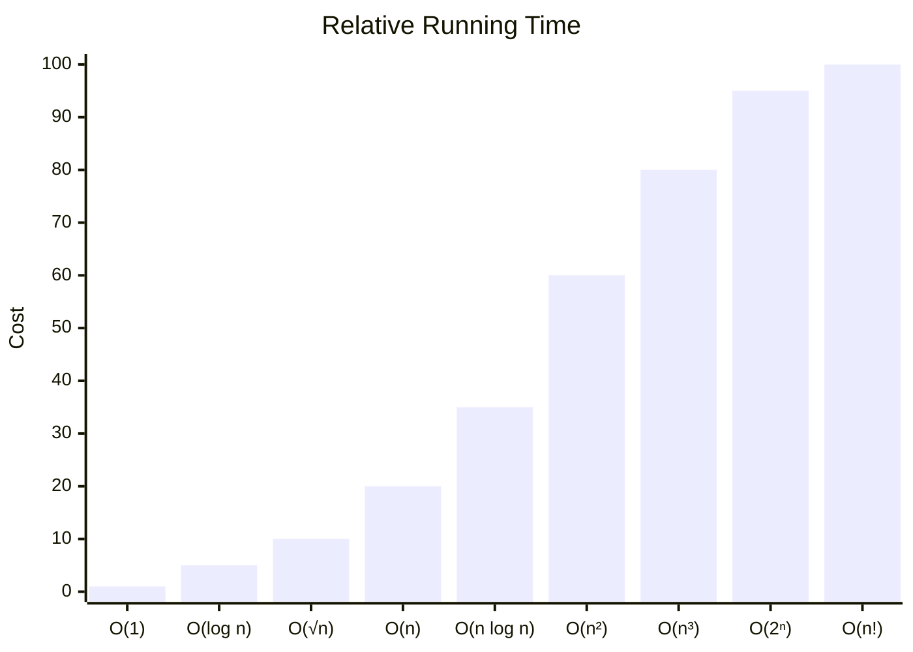

## When to Use Each Complexity

| Complexity | When to Use | When to Avoid |
|------------|-------------|---------------|
| O(1) | Always preferred | When not achievable |
| O(log n) | For sorted data | When data changes frequently |
| O(n) | For simple traversals | When data is extremely large |
| O(n log n) | For sorting | When O(n) is possible |
| O(n²) | For very small n | For n > 1000 |
| O(n³) | For very small n | For n > 100 |
| O(2ⁿ) | Only for n < 20 | For n > 20 |
| O(n!) | Only for n < 10 | For n > 10 |

💡 **Interview Tip**: Most interview problems expect solutions between O(log n) and O(n log n). O(n²) is rarely acceptable for large inputs.

---

# 7. Rules for Calculating Time Complexity

## 1. Ignoring Constants

Constants don't affect growth rate. Drop all constants.

### Examples:
```
3n² + 5n + 2 → O(n²)
2n → O(n)
100 → O(1)
5n log n + 3n → O(n log n)
```

### Python Example:
```python
def example(n):
    # 5 assignments
    a = 0
    b = 1
    c = 2
    d = 3
    e = 4
    
    # n iterations
    for i in range(n):
        # 3 operations per iteration
        a += i
        b += i * 2
        c = a + b
    
    # 10 operations
    for i in range(10):
        d += i
    
    return a

# Total: 5 + 3n + 10 = 3n + 15
# Drop constant: O(n)
```

## 2. Dropping Lower-order Terms

Keep only the highest-order term. Lower-order terms become insignificant for large n.

### Examples:
```
n³ + n² + n → O(n³)
2ⁿ + n² → O(2ⁿ)
n log n + n → O(n log n)
n² + n log n → O(n²)
```

## 3. Nested Loops

Multiply the complexity of nested loops.

### Examples:

**Two nested loops O(n²):**
```python
for i in range(n):          # O(n)
    for j in range(n):      # O(n)
        # O(1) operation
# Total: O(n) × O(n) = O(n²)
```

**Three nested loops O(n³):**
```python
for i in range(n):          # O(n)
    for j in range(n):      # O(n)
        for k in range(n):  # O(n)
            # O(1) operation
# Total: O(n) × O(n) × O(n) = O(n³)
```

**Nested with different bounds O(m × n):**
```python
for i in range(m):          # O(m)
    for j in range(n):      # O(n)
        # O(1) operation
# Total: O(m × n)
```

## 4. Sequential Loops

Add the complexity of sequential loops.

### Examples:

**Two sequential loops O(n):**
```python
for i in range(n):          # O(n)
    # O(1) operation

for j in range(n):          # O(n)
    # O(1) operation
# Total: O(n) + O(n) = O(2n) = O(n)
```

**Different sequential loops O(n + m):**
```python
for i in range(n):          # O(n)
    # O(1) operation

for j in range(m):          # O(m)
    # O(1) operation
# Total: O(n) + O(m) = O(n + m)
```

**Mixed loops:**
```python
for i in range(n):          # O(n)
    for j in range(n):      # O(n)
        # O(1) operation

for k in range(n):          # O(n)
    # O(1) operation
# Total: O(n²) + O(n) = O(n²)
```

## 5. Recursion

Recursion complexity depends on:
- Number of recursive calls
- Size of each subproblem

### Examples:

**Single recursive call with reduced size:**
```python
def factorial(n):
    if n <= 1:
        return 1
    return n * factorial(n-1)

# T(n) = T(n-1) + O(1)
# Time: O(n)
```

**Two recursive calls with halved size:**
```python
def binary_search(arr, target, left, right):
    if left > right:
        return -1
    mid = (left + right) // 2
    if arr[mid] == target:
        return mid
    elif arr[mid] < target:
        return binary_search(arr, target, mid+1, right)
    else:
        return binary_search(arr, target, left, mid-1)

# T(n) = T(n/2) + O(1)
# Time: O(log n)
```

**Two recursive calls:**
```python
def fibonacci(n):
    if n <= 1:
        return n
    return fibonacci(n-1) + fibonacci(n-2)

# T(n) = T(n-1) + T(n-2) + O(1)
# Time: O(2ⁿ)
```

## 6. Logarithms

Logarithms appear when the problem size is reduced by a constant factor.

### Examples:

**Halving:**
```python
i = n
while i > 1:
    i = i // 2
    # O(1) operation
# Time: O(log n)
```

**Doubling:**
```python
i = 1
while i < n:
    i = i * 2
    # O(1) operation
# Time: O(log n)
```

**Binary search:**
```python
left, right = 0, n-1
while left <= right:
    mid = (left + right) // 2
    if arr[mid] == target:
        return mid
    elif arr[mid] < target:
        left = mid + 1
    else:
        right = mid - 1
# Time: O(log n)
```

## 7. Master Theorem

The Master Theorem is a shortcut for solving recurrences of the form:

$$
T(n) = aT(n/b) + f(n)
$$

where $a \ge 1$, $b > 1$, and $f(n)$ is an asymptotically positive function.

The key idea is to compare the non-recursive work $f(n)$ with the recursive work level:

$$
n^{\log_b a}
$$

If the recursive work dominates, the total cost is driven by the number of recursive calls. If the non-recursive work dominates, the extra work at each level controls the runtime.

### Decision Tree for Applying the Theorem

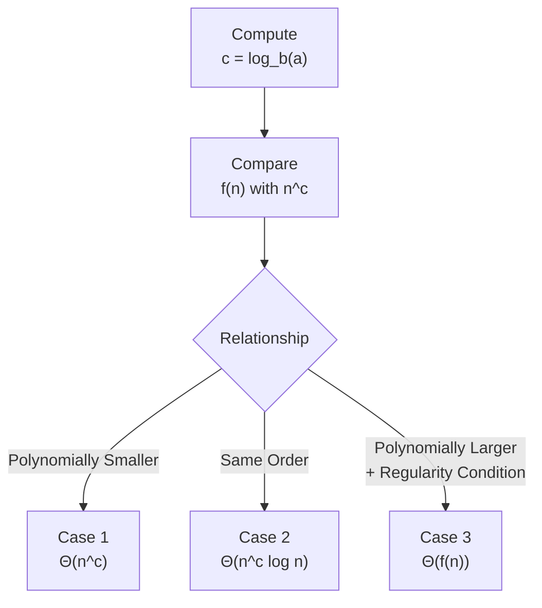

### Case 1: When Recursive Work Dominates
- Condition: $f(n) = O(n^{\log_b a - \epsilon})$ for some $\epsilon > 0$
- Result: $T(n) = \Theta(n^{\log_b a})$

This case happens when the recursive calls create more work than the extra work done at each level.

Examples:
- $T(n) = 2T(n/2) + 1$
  - Here, $\log_b a = \log_2 2 = 1$
  - Since $1 = O(n^{1-\epsilon})$, this is Case 1
  - Result: $T(n) = \Theta(n)$
- $T(n) = 3T(n/3) + \log n$
  - $\log_3 3 = 1$
  - $\log n$ is smaller than $n^{1-\epsilon}$
  - Result: $T(n) = \Theta(n)$
- $T(n) = 4T(n/2) + n^{0.5}$
  - $\log_2 4 = 2$
  - $n^{0.5}$ is smaller than $n^{2-\epsilon}$
  - Result: $T(n) = \Theta(n^2)$

Code pattern:
```python
def solve(n):
    if n <= 1:
        return
    solve(n // 2)
    solve(n // 2)
    # O(1) work here
```

This has recurrence $T(n) = 2T(n/2) + O(1)$, which falls into Case 1.

### Case 2: When Work is Balanced
- Condition: $f(n) = \Theta(n^{\log_b a})$
- Result: $T(n) = \Theta(n^{\log_b a} \log n)$

This is the middle case, where the recursive work and the non-recursive work are the same order.

Examples:
- $T(n) = 2T(n/2) + n$
  - $\log_2 2 = 1$
  - $f(n) = n = \Theta(n^1)$
  - Result: $T(n) = \Theta(n \log n)$
- $T(n) = 3T(n/3) + n$
  - $\log_3 3 = 1$
  - $f(n) = n = \Theta(n^1)$
  - Result: $T(n) = \Theta(n \log n)$
- $T(n) = 4T(n/2) + n^2$
  - $\log_2 4 = 2$
  - $f(n) = n^2 = \Theta(n^2)$
  - Result: $T(n) = \Theta(n^2 \log n)$

Code pattern:
```python
def merge_sort(arr):
    if len(arr) <= 1:
        return arr
    mid = len(arr) // 2
    left = merge_sort(arr[:mid])
    right = merge_sort(arr[mid:])
    return merge(left, right)
```

This is the classic example of Case 2 because merging costs linear time at each level.

### Case 3: When Non-Recursive Work Dominates
- Condition: $f(n) = \Omega(n^{\log_b a + \epsilon})$ for some $\epsilon > 0$, and $a \cdot f(n/b) \le c \cdot f(n)$ for some constant $c < 1$ and sufficiently large $n$
- Result: $T(n) = \Theta(f(n))$

This case happens when the extra work done at each level is larger than the recursive branching cost.

Examples:
- $T(n) = 2T(n/2) + n^2$
  - $\log_2 2 = 1$
  - $f(n) = n^2$ is polynomially larger than $n^1$
  - Result: $T(n) = \Theta(n^2)$
- $T(n) = 3T(n/3) + n^2$
  - $\log_3 3 = 1$
  - $n^2$ dominates $n$
  - Result: $T(n) = \Theta(n^2)$
- $T(n) = 4T(n/2) + n^3$
  - $\log_2 4 = 2$
  - $n^3$ dominates $n^2$
  - Result: $T(n) = \Theta(n^3)$

Code pattern:
```python
def solve(n):
    if n <= 1:
        return
    solve(n // 2)
    solve(n // 2)
    # O(n^2) work here
```

This recurrence behaves like $T(n) = 2T(n/2) + O(n^2)$, which is Case 3.

### Quick Reference Table

| Recurrence | a | b | $\log_b a$ | $f(n)$ | Case | Result |
|------------|---|---|-------------|--------|------|--------|
| $T(n) = 2T(n/2) + n$ | 2 | 2 | 1 | $n$ | 2 | $\Theta(n \log n)$ |
| $T(n) = 2T(n/2) + 1$ | 2 | 2 | 1 | $1$ | 1 | $\Theta(n)$ |
| $T(n) = 2T(n/2) + n^2$ | 2 | 2 | 1 | $n^2$ | 3 | $\Theta(n^2)$ |

### Common Mistakes

- Using the theorem for recurrences that are not of the form $T(n) = aT(n/b) + f(n)$.
- Forgetting that the comparison is with $n^{\log_b a}$, not with $a$ or $b$ directly.
- Mixing up the three cases and labeling examples incorrectly.
- Forgetting the regularity condition in Case 3.
- Assuming that recursion always dominates just because there are many recursive calls.

## 9. Dynamic Programming vs Recursion

Dynamic programming and recursion are closely related, but they differ in how they handle repeated subproblems.

### Comparison Table

| Aspect | Naive Recursion | Memoized Recursion | Iterative DP |
|--------|----------------|-------------------|--------------|
| Time Complexity | O(2^n) | O(n) | O(n) |
| Space Complexity | O(n) | O(n) | O(n) or O(1) |
| Stack Usage | Yes | Yes | No |
| Overhead | High | Medium | Low |
| Readability | High | Medium | Medium |

### Fibonacci Examples

```python
# Approach 1: Naive Recursion
def fib_recursive(n):
    if n <= 1:
        return n
    return fib_recursive(n - 1) + fib_recursive(n - 2)
```

```python
# Approach 2: Memoized Recursion
def fib_memo(n, memo={}):
    if n in memo:
        return memo[n]
    if n <= 1:
        return n
    memo[n] = fib_memo(n - 1, memo) + fib_memo(n - 2, memo)
    return memo[n]
```

```python
# Approach 3: Iterative DP
def fib_dp(n):
    if n <= 1:
        return n
    a, b = 0, 1
    for _ in range(2, n + 1):
        a, b = b, a + b
    return b
```

```python
# Approach 4: Space Optimized DP
def fib_optimized(n):
    if n <= 1:
        return n
    a, b = 0, 1
    for _ in range(2, n + 1):
        a, b = b, a + b
    return b
```

### Visual Comparison

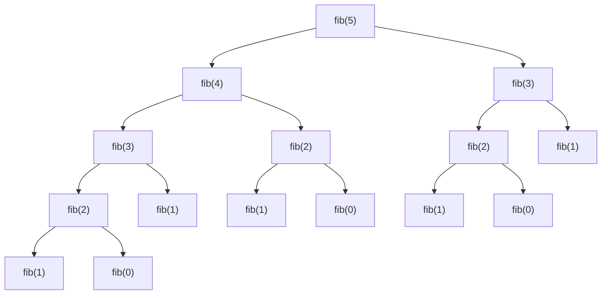

```text
Memoized Recursion:
Each subproblem is solved once and reused.
```

```text
Iterative DP:
Build from the bottom up using a small table or rolling variables.
```

When to use each approach:
- Naive recursion: best for simple teaching examples and small inputs.
- Memoized recursion: good when the recursive structure is natural and the state space is manageable.
- Iterative DP: usually the best choice for production code because it avoids recursion overhead.
- Space-optimized DP: ideal when only the last few states are needed.

Interview tips:
- If you see overlapping subproblems, think dynamic programming.
- If the recursive structure is clear but repeated work is expensive, add memoization.
- If the interviewer asks for the best practical solution, iterative DP is often the answer.

## 8. Amortized Analysis

Amortized analysis studies the average cost of a sequence of operations, rather than the worst-case cost of a single operation. It is useful when some operations are expensive, but those expensive operations happen rarely enough that the average over many operations stays small.

### Formal Definition

Let the cost of the $i$-th operation be $c_i$. The amortized cost of a sequence of $m$ operations is:

$$
\text{amortized cost} = \frac{\sum_{i=1}^{m} c_i}{m}
$$

So even if one operation costs $O(n)$, the average cost over many operations can still be $O(1)$.

### 1. Aggregate Method

The aggregate method computes the total cost of a sequence of operations and divides by the number of operations.

#### Dynamic Array Resizing

Suppose we use a dynamic array that doubles its capacity when full.

```python
class DynamicArray:
    def __init__(self):
        self.arr = [None] * 1
        self.size = 0
        self.capacity = 1

    def append(self, value):
        if self.size == self.capacity:
            # Resize to twice the old capacity
            new_arr = [None] * (self.capacity * 2)
            for i in range(self.size):
                new_arr[i] = self.arr[i]
            self.arr = new_arr
            self.capacity *= 2

        self.arr[self.size] = value
        self.size += 1
```

If we perform $n$ append operations:
- The first resize costs $1$
- The next resize costs $2$
- The next costs $4$
- ...
- The last resize costs about $n/2$

So the total resizing cost is:

$$
1 + 2 + 4 + \cdots + n = O(n)
$$

The $n$ appends themselves cost $O(n)$, so the total cost is:

$$
O(n) + O(n) = O(n)
$$

Thus the amortized cost per append is:

$$
\frac{O(n)}{n} = O(1)
$$

This is why dynamic arrays have amortized $O(1)$ append time.

#### Sequence of $n$ operations

If we call `append` $n$ times, the total work is roughly:

$$
n + (1 + 2 + 4 + \dots + n) \approx 3n
$$

So the amortized cost per operation is:

$$
\frac{3n}{n} = O(1)
$$

### 2. Accounting Method

The accounting method assigns each operation a charge that may be more than its actual immediate cost, storing the extra “credit” for future expensive operations.

For dynamic arrays:
- Each append is charged $O(1)$ actual cost plus a little extra credit.
- That extra credit is saved for future resizing.
- Over time, the stored credits pay for the expensive resize operations.

This gives the same conclusion: amortized append time is $O(1)$.

### 3. Potential Method

The potential method uses a potential function $\Phi(D_i)$ that measures the “extra stored energy” of the data structure after operation $i$.

The amortized cost is defined as:

$$
\hat{c_i} = c_i + \Phi(D_i) - \Phi(D_{i-1})
$$

where:
- $c_i$ is the actual cost of operation $i$
- $D_i$ is the state after operation $i$
- $\Phi(D_i)$ is the potential function

#### Potential for Dynamic Array

Define the potential as:

$$
\Phi(D_i) = 2 \cdot \text{size} - \text{capacity}
$$

When the array is full, the capacity equals the size, so the potential is:

$$
\Phi = 2s - s = s
$$

When the array has room, the potential is smaller.

- If an append does not resize, the actual cost is $O(1)$ and the potential change is $O(1)$.
- If an append triggers a resize, the actual cost is $O(s)$, but the potential increase is large enough to compensate.

Hence the total amortized cost remains $O(1)$ per operation.

### Dynamic Array Example Summary

- Actual cost of append: $O(1)$ most of the time, $O(n)$ on resize
- Total cost over $n$ operations: $O(n)$
- Amortized cost: $O(1)$

### Hash Table Resizing

Hash tables also use amortized analysis when they resize their internal array.

```python
class HashTable:
    def __init__(self):
        self.size = 4
        self.table = [None] * self.size
        self.count = 0

    def insert(self, key, value):
        if self.count / self.size >= 0.75:
            # Resize to double the size
            old_table = self.table
            self.size *= 2
            self.table = [None] * self.size
            self.count = 0
            for entry in old_table:
                if entry is not None:
                    for k, v in entry:
                        self._insert_no_resize(k, v)

        self._insert_no_resize(key, value)
        self.count += 1
```

Explanation:
- Most insertions are $O(1)$ average time.
- Occasionally, a resize costs $O(n)$.
- Over many insertions, the total resize cost is still linear in the number of inserts.
- Therefore the amortized insertion cost is $O(1)$ average.

### Stack with Multipop

A stack that supports both `push` and `multipop` can also be analyzed amortized.

```python
class Stack:
    def __init__(self):
        self.items = []

    def push(self, x):
        self.items.append(x)

    def pop(self):
        if self.items:
            return self.items.pop()
        return None

    def multipop(self, k):
        removed = []
        while self.items and k > 0:
            removed.append(self.pop())
            k -= 1
        return removed
```

For a sequence of operations:
- `push` costs $O(1)$
- `pop` costs $O(1)$
- `multipop(k)` can cost up to $O(k)$

But each element can be removed only once, so the total cost of all pops over a sequence is bounded by the total number of pushes.

Thus the amortized cost of each operation is still $O(1)$.

### Amortized vs Average-Case Analysis

These are related but not identical:

- Amortized analysis studies the average over a sequence of operations.
- Average-case analysis studies the expected behavior over random inputs.

Use amortized analysis when:
- expensive operations happen occasionally
- the cost is spread out over many operations
- you want a bound over a sequence, not a single random input

Use average-case analysis when:
- you want expected performance over random input distributions
- the input itself is random or probabilistic

### Common Interview Questions

- Why is appending to a dynamic array amortized $O(1)$?
- What is the difference between amortized and average-case analysis?
- How does the potential method prove an amortized bound?
- Why does hash table insertion become amortized $O(1)$ after resizing?
- Why does stack `multipop` have amortized $O(1)$ cost?

---

# 8. Time Complexity of Loops

## Single Loop

### Standard Single Loop
```python
for i in range(n):          # n iterations
    # O(1) operation
# Time: O(n)
```

### Single Loop with Constant
```python
for i in range(2*n):        # 2n iterations
    # O(1) operation
# Time: O(2n) = O(n)
```

### Single Loop with Constant Factor
```python
for i in range(n//2):       # n/2 iterations
    # O(1) operation
# Time: O(n/2) = O(n)
```

## Nested Loops

### Independent Nested Loops
```python
for i in range(n):          # n iterations
    for j in range(m):      # m iterations each
        # O(1) operation
# Time: O(n × m)
```

### Dependent Nested Loops
```python
for i in range(n):          # n iterations
    for j in range(i):      # i iterations each
        # O(1) operation
# Total: n(n-1)/2 = O(n²)
```

### Decreasing Nested Loops
```python
for i in range(n):          # n iterations
    for j in range(n-i):    # n-i iterations each
        # O(1) operation
# Total: n + (n-1) + ... + 1 = n(n+1)/2 = O(n²)
```

## while Loop

### Simple while Loop
```python
i = 0
while i < n:                # n iterations
    # O(1) operation
    i += 1
# Time: O(n)
```

### while Loop with Variable Increment
```python
i = 0
while i < n:                # n iterations
    # O(1) operation
    i += 2                  # Increment by 2
# Time: O(n/2) = O(n)
```

## Logarithmic Loops

### Halving Loop
```python
i = n
while i > 0:
    # O(1) operation
    i //= 2
# Time: O(log n)
```

### Doubling Loop
```python
i = 1
while i < n:
    # O(1) operation
    i *= 2
# Time: O(log n)
```

### Variable Halving
```python
i = n
while i > 0:
    # O(1) operation
    i //= 3
# Time: O(log₃ n) = O(log n)
```

## Mixed Loops

### Loop with Logarithmic Outer and Linear Inner
```python
for i in range(n):          # O(n)
    j = n
    while j > 1:            # O(log n)
        # O(1) operation
        j //= 2
# Time: O(n log n)
```

### Loop with Linear Outer and Logarithmic Inner
```python
i = 1
while i < n:                # O(log n)
    for j in range(n):      # O(n)
        # O(1) operation
    i *= 2
# Time: O(n log n)
```

### Nested with Different Complexities
```python
for i in range(n):          # O(n)
    for j in range(n):      # O(n)
        k = n
        while k > 1:        # O(log n)
            # O(1) operation
            k //= 2
# Time: O(n² log n)
```

## Recursive Loops

```python
def recursive_loop(n):
    if n <= 0:
        return
    # Process n elements (O(n) work)
    for i in range(n):
        print(i)
    recursive_loop(n//2)    # Recursive call with n/2

# T(n) = T(n/2) + O(n)
# By Master Theorem: T(n) = O(n)
```

## Loop Analysis Examples

### Example 1: Multiple Independent Loops
```python
def example1(n):
    # O(n)
    for i in range(n):
        print(i)
    
    # O(n²)
    for i in range(n):
        for j in range(n):
            print(i, j)
    
    # O(n)
    for i in range(n):
        print(i)

# Total: O(n) + O(n²) + O(n) = O(n²)
```

### Example 2: Loop with Break
```python
def example2(arr, target):
    for i in range(len(arr)):   # O(n)
        if arr[i] == target:
            return i            # Early exit
    return -1

# Best case: O(1)
# Worst case: O(n)
# Average case: O(n)
# Time: O(n)
```

### Example 3: Loop with Conditional Inside
```python
def example3(n):
    total = 0
    for i in range(n):          # O(n)
        if i % 2 == 0:          # O(1)
            total += i
        for j in range(n):      # O(n) - runs for every i
            total += 1
    return total

# Outer loop: n iterations
# Inner loop: n iterations for each outer
# Total: O(n) × O(n) = O(n²)
```

### Example 4: Loop with Variable Bound
```python
def example4(n):
    count = 0
    for i in range(n):          # n iterations
        for j in range(i*i):    # i² iterations each
            count += 1
    return count

# Total operations: Σ(i²) for i=0 to n-1
# = 0² + 1² + 2² + ... + (n-1)²
# = n(n-1)(2n-1)/6
# = O(n³)
```

---

# 9. Time Complexity of Recursion

## Recurrence Relation

A recurrence relation describes the time complexity of a recursive algorithm in terms of the time for smaller inputs.

**General Form:**
```
T(n) = aT(n/b) + f(n)
```
where:
- a = number of recursive calls
- n/b = size of each subproblem
- f(n) = work done outside recursion

## Recursion Tree

A recursion tree visualizes the recursive calls and their work.

### Example: Merge Sort
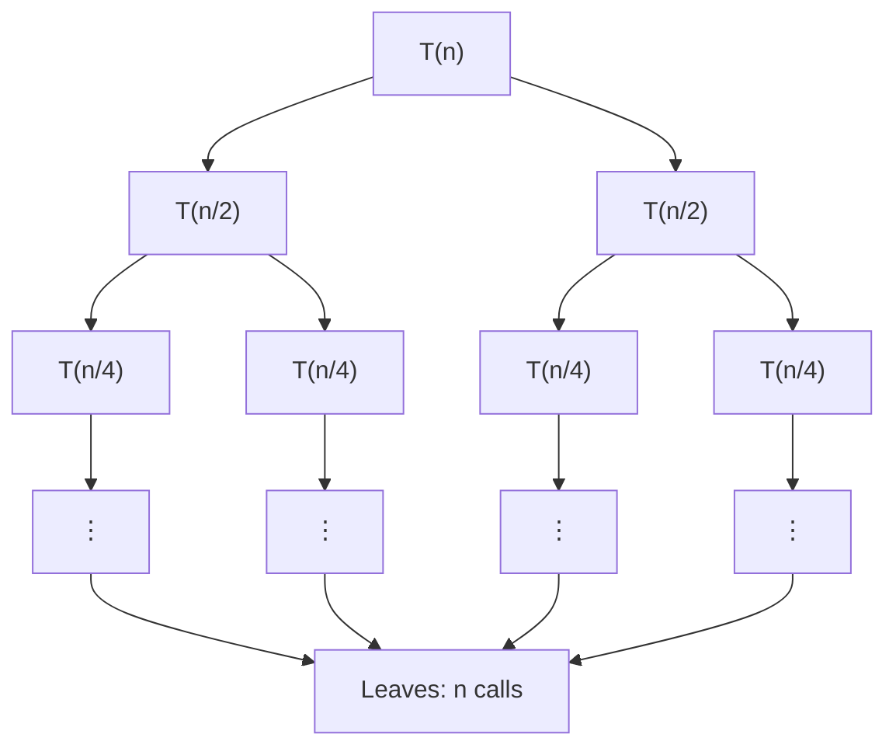
   Leaves: 2^log n = n calls
   
   Total work per level = n
   Number of levels = log n
   Total work = n log n

### Example: Fibonacci
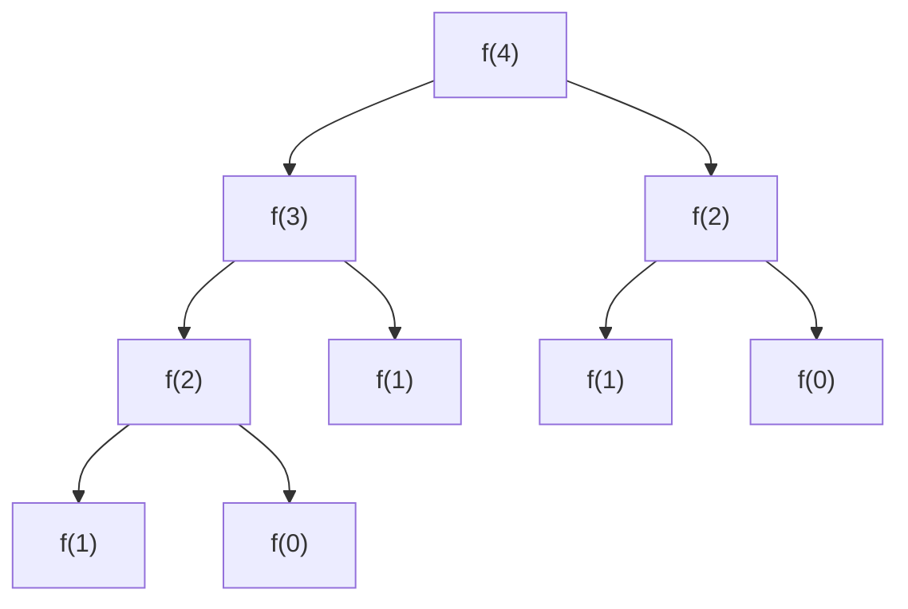
   Number of nodes = 2^(n+1) - 1
   Time = O(2^n)


## 📖 Master Theorem Cases

---

### 🔹 Case 1: Recursive Work Dominates

When the work done by the recursive calls grows faster than the work outside recursion.

**Condition**

```math
f(n) = O\left(n^{\log_b a-\varepsilon}\right), \quad \varepsilon > 0
```

**Result**

```math
T(n)=\Theta\left(n^{\log_b a}\right)
```

#### ✅ Example

```text
T(n) = 4T(n/2) + n
```

| Parameter | Value |
|-----------|-------|
| a | 4 |
| b | 2 |
| log₂4 | 2 |
| f(n) | n = O(n^(2−1)) |

**Therefore**

```text
T(n) = Θ(n²)
```

> 💡 **Reason:** Recursive calls perform significantly more work than the extra work `f(n)`.

---

### 🔹 Case 2: Equal Work

When the recursive work and non-recursive work grow at the same rate.

**Condition**

```math
f(n)=\Theta\left(n^{\log_b a}\right)
```

**Result**

```math
T(n)=\Theta\left(n^{\log_b a}\log n\right)
```

#### ✅ Example

```text
T(n)=2T(n/2)+n
```

| Parameter | Value |
|-----------|-------|
| a | 2 |
| b | 2 |
| log₂2 | 1 |
| f(n) | n = Θ(n¹) |

**Therefore**

```text
T(n)=Θ(n log n)
```

> 💡 **Reason:** Every level of the recursion tree performs the same amount of work.

---

### 🔹 Case 3: Non-Recursive Work Dominates

When the work outside recursion grows faster than the recursive work.

**Condition**

```math
f(n)=\Omega\left(n^{\log_b a+\varepsilon}\right), \quad \varepsilon > 0
```

and the **Regularity Condition** holds:

```math
a \cdot f(n/b) \le c \cdot f(n), \quad c < 1
```

**Result**

```math
T(n)=\Theta(f(n))
```

#### ✅ Example

```text
T(n)=2T(n/2)+n²
```

| Parameter | Value |
|-----------|-------|
| a | 2 |
| b | 2 |
| log₂2 | 1 |
| f(n) | n² = Ω(n^(1+1)) |

**Regularity Check**

```text
2 × (n/2)²
= 2 × (n²/4)
= n²/2
≤ c·n²
```

Choose

```text
c = 1/2
```

**Therefore**

```text
T(n)=Θ(n²)
```

> 💡 **Reason:** The non-recursive work `f(n)` dominates the total running time.

---

## 🎯 Quick Summary

| Case | Compare `f(n)` with `n^(log_b a)` | Time Complexity |
|:----:|----------------------------------|-----------------|
| **1** | Smaller | **Θ(n^(log_b a))** |
| **2** | Equal | **Θ(n^(log_b a) log n)** |
| **3** | Larger | **Θ(f(n))** |

## Examples

### Binary Search
```python
def binary_search(arr, target, left, right):
    if left > right:
        return -1
    
    mid = (left + right) // 2
    
    if arr[mid] == target:
        return mid
    elif arr[mid] < target:
        return binary_search(arr, target, mid + 1, right)
    else:
        return binary_search(arr, target, left, mid - 1)

# Recurrence: T(n) = T(n/2) + O(1)
# a=1, b=2, log_b a = 0
# f(n) = 1 = Θ(n^0)
# Case 2: T(n) = Θ(log n)
```

### Merge Sort
```python
def merge_sort(arr):
    if len(arr) <= 1:
        return arr
    
    mid = len(arr) // 2
    left = merge_sort(arr[:mid])
    right = merge_sort(arr[mid:])
    
    return merge(left, right)

def merge(left, right):
    result = []
    i = j = 0
    
    while i < len(left) and j < len(right):
        if left[i] < right[j]:
            result.append(left[i])
            i += 1
        else:
            result.append(right[j])
            j += 1
    
    result.extend(left[i:])
    result.extend(right[j:])
    return result

# Recurrence: T(n) = 2T(n/2) + O(n)
# a=2, b=2, log_b a = 1
# f(n) = n = Θ(n^1)
# Case 2: T(n) = Θ(n log n)
```

### Quick Sort
```python
def quick_sort(arr, low, high):
    if low < high:
        pi = partition(arr, low, high)
        quick_sort(arr, low, pi - 1)
        quick_sort(arr, pi + 1, high)

def partition(arr, low, high):
    pivot = arr[high]
    i = low - 1
    
    for j in range(low, high):
        if arr[j] <= pivot:
            i += 1
            arr[i], arr[j] = arr[j], arr[i]
    
    arr[i + 1], arr[high] = arr[high], arr[i + 1]
    return i + 1

# Best/Average: T(n) = 2T(n/2) + O(n) → O(n log n)
# Worst: T(n) = T(n-1) + O(n) → O(n²)
# Time: O(n log n) average, O(n²) worst
```

### Tower of Hanoi
```python
def tower_of_hanoi(n, source, target, auxiliary):
    if n == 1:
        print(f"Move disk 1 from {source} to {target}")
        return
    
    tower_of_hanoi(n-1, source, auxiliary, target)
    print(f"Move disk {n} from {source} to {target}")
    tower_of_hanoi(n-1, auxiliary, target, source)

# Recurrence: T(n) = 2T(n-1) + O(1)
# Time: O(2ⁿ)
```

### Fibonacci (Naive)
```python
def fibonacci(n):
    if n <= 1:
        return n
    return fibonacci(n-1) + fibonacci(n-2)

# Recurrence: T(n) = T(n-1) + T(n-2) + O(1)
# Time: O(2ⁿ)
# Space: O(n) (recursion stack)
```

### DFS on Tree
```python
def dfs(node):
    if node is None:
        return
    
    print(node.val)
    dfs(node.left)
    dfs(node.right)

# Recurrence: T(n) = 2T(n/2) + O(1) (balanced tree)
# T(n) = O(n) (visits each node once)
# Time: O(n) where n = number of nodes
# Space: O(h) where h = height of tree
```

### Tree Traversals
```python
def inorder(node):
    if node is None:
        return
    inorder(node.left)
    print(node.val)
    inorder(node.right)

def preorder(node):
    if node is None:
        return
    print(node.val)
    preorder(node.left)
    preorder(node.right)

def postorder(node):
    if node is None:
        return
    postorder(node.left)
    postorder(node.right)
    print(node.val)

# All traversals: O(n) time, O(h) space
```

---

# 10. Space Complexity in Recursion

## Recursion Stack

Every recursive call consumes memory on the stack. The stack depth determines the space complexity.

### Example: Recursive Factorial
```python
def factorial(n):
    if n <= 1:
        return 1
    return n * factorial(n-1)

# Space: O(n) for the recursion stack
# Each call: stores n, return address, etc.
```

### Example: Fibonacci (Naive)
```python
def fibonacci(n):
    if n <= 1:
        return n
    return fibonacci(n-1) + fibonacci(n-2)
```

This recursive version has exponential time complexity, $O(2^n)$, because each call branches into two smaller calls. However, its space complexity is only $O(n)$ because the recursion uses a single path of active calls at a time.

Why space is $O(n)$:
- The maximum recursion depth is at most $n$ levels.
- Each recursive call waits for its child call to finish before continuing.
- So the stack grows along one branch, not across all branches simultaneously.

In other words, the branching increases the number of computations (time), but it does not increase the amount of memory needed at any single moment.

Step-by-step stack depth for `fibonacci(5)`:
1. `fibonacci(5)` is called
2. It calls `fibonacci(4)`
3. `fibonacci(4)` calls `fibonacci(3)`
4. `fibonacci(3)` calls `fibonacci(2)`
5. `fibonacci(2)` calls `fibonacci(1)`

At the deepest point, the call stack looks like this:

```text
fibonacci(5)
  fibonacci(4)
    fibonacci(3)
      fibonacci(2)
        fibonacci(1)
```

That is a stack depth of about $n$, so the extra space is $O(n)$.

Why the two branches do not increase space:
- The function makes two recursive calls, but only one branch is actively being resolved at a time.
- The parent call stays on the stack while the child call runs.
- Once the child returns, the parent continues, and the next branch is processed.

Comparison with an iterative version:
```python
def fibonacci_iterative(n):
    a, b = 0, 1
    for _ in range(n):
        a, b = b, a + b
    return a
```

This iterative version uses only a few variables, so it has $O(1)$ extra space. The tradeoff is that recursion is often easier to read, while iteration can be more memory-efficient.

Interview tip:
- Do not confuse time complexity with space complexity.
- A recursive algorithm can have very high time cost but still use only linear stack space if it explores one branch at a time.
- When you see branching recursion, ask: "How many calls are active at once?" That usually reveals the space complexity.

### Example: Binary Search (Recursive)
```python
def binary_search(arr, target, left, right):
    if left > right:
        return -1
    
    mid = (left + right) // 2
    
    if arr[mid] == target:
        return mid
    elif arr[mid] < target:
        return binary_search(arr, target, mid + 1, right)
    else:
        return binary_search(arr, target, left, mid - 1)

# Space: O(log n) for recursion stack
# Each call halves the search space
```

## Tail Recursion Optimization

Some languages optimize tail recursion (Python doesn't).

### Example: Tail Recursion
```python
def factorial_tail(n, accumulator=1):
    if n <= 1:
        return accumulator
    return factorial_tail(n-1, n * accumulator)

# This could be optimized to O(1) space in tail-call optimized languages
# In Python: still O(n) space
```

## Space Complexity Examples

| Algorithm | Time Complexity | Space Complexity | Space Reason |
|-----------|----------------|------------------|--------------|
| Factorial (recursive) | O(n) | O(n) | Recursion stack |
| Factorial (iterative) | O(n) | O(1) | No stack |
| Merge Sort | O(n log n) | O(n) | Auxiliary array |
| Quick Sort | O(n log n) | O(log n) | Recursion stack |
| Binary Search | O(log n) | O(1) / O(log n) | Iterative/Recursive |
| DFS (recursive) | O(V+E) | O(V) | Recursion stack |
| DFS (iterative) | O(V+E) | O(V) | Explicit stack |
| Tree Traversal (recursive) | O(n) | O(h) | Recursion stack |

💡 **Interview Tip**: In interviews, always mention both time and space complexity, especially for recursive solutions.

---

# 11. Complexity of Common Operations

## Arrays

| Operation | Time Complexity | Space Complexity |
|-----------|----------------|------------------|
| Access by index | O(1) | O(1) |
| Search (unsorted) | O(n) | O(1) |
| Search (sorted) | O(log n) | O(1) |
| Insertion (beginning) | O(n) | O(1) |
| Insertion (end) | O(1) amortized | O(1) |
| Insertion (middle) | O(n) | O(1) |
| Deletion (beginning) | O(n) | O(1) |
| Deletion (end) | O(1) | O(1) |
| Deletion (middle) | O(n) | O(1) |
| Traversal | O(n) | O(1) |
| Sorting (compare-based) | O(n log n) | O(1)-O(n) |

## Strings

| Operation | Algorithm | Time Complexity | Space Complexity |
|-----------|-----------|-----------------|------------------|
| Substring Search | Naive | O(n*m) worst | O(1) |
| Substring Search | KMP | O(n+m) | O(m) |
| Substring Search | Boyer-Moore | O(n+m) worst | O(m) |
| Substring Search | Rabin-Karp | O(n+m) avg | O(1) |

### Brief Explanation
- Naive: checks every starting position and compares character by character.
- KMP: preprocesses the pattern to skip unnecessary comparisons using a prefix table.
- Boyer-Moore: matches from the end of the pattern and skips large portions of the text.
- Rabin-Karp: uses rolling hash to compare the pattern against substrings efficiently.

### When to Use Each
- Naive: small strings or simple teaching examples.
- KMP: deterministic linear-time matching when you want guaranteed performance.
- Boyer-Moore: very effective on large text and patterns with strong character mismatches.
- Rabin-Karp: useful when matching many patterns or when hashing is convenient.

### KMP Code Example
```python
def build_lps(pattern):
    lps = [0] * len(pattern)
    j = 0
    for i in range(1, len(pattern)):
        while j > 0 and pattern[i] != pattern[j]:
            j = lps[j - 1]
        if pattern[i] == pattern[j]:
            j += 1
        lps[i] = j
    return lps


def kmp_search(text, pattern):
    lps = build_lps(pattern)
    j = 0
    for i in range(len(text)):
        while j > 0 and text[i] != pattern[j]:
            j = lps[j - 1]
        if text[i] == pattern[j]:
            j += 1
        if j == len(pattern):
            return i - len(pattern) + 1
    return -1
```

### Rabin-Karp Code Example
```python
def rabin_karp_search(text, pattern):
    if len(pattern) > len(text):
        return -1

    base = 911382629
    mod = 10**9 + 7
    pat_hash = 0
    window_hash = 0

    for i in range(len(pattern)):
        pat_hash = (pat_hash * base + ord(pattern[i])) % mod
        window_hash = (window_hash * base + ord(text[i])) % mod

    if pat_hash == window_hash and text[:len(pattern)] == pattern:
        return 0

    pow_base = 1
    for _ in range(len(pattern) - 1):
        pow_base = (pow_base * base) % mod

    for i in range(len(pattern), len(text)):
        window_hash = (window_hash * base - ord(text[i-len(pattern)]) * pow_base + ord(text[i])) % mod
        if pat_hash == window_hash and text[i-len(pattern)+1:i+1] == pattern:
            return i - len(pattern) + 1

    return -1
```

### Interview Tips
- If the interviewer says "substring search" without naming an algorithm, the naive solution is often the first thing to mention.
- If the problem asks for guaranteed linear time, KMP is a strong answer.
- If the problem involves large text and repeated matching, Boyer-Moore or Rabin-Karp can be more practical.
- Always mention both time and space complexity, especially when comparing multiple string-matching strategies.

## Linked List

| Operation | Time Complexity | Space Complexity |
|-----------|----------------|------------------|
| Access by index | O(n) | O(1) |
| Search | O(n) | O(1) |
| Insertion (head) | O(1) | O(1) |
| Insertion (tail) | O(1) with tail | O(1) |
| Insertion (middle) | O(n) | O(1) |
| Deletion (head) | O(1) | O(1) |
| Deletion (tail) | O(n) | O(1) |
| Deletion (middle) | O(n) | O(1) |
| Traversal | O(n) | O(1) |
| Reverse | O(n) | O(1) |

## Stack

| Operation | Time Complexity | Space Complexity |
|-----------|----------------|------------------|
| Push | O(1) | O(1) |
| Pop | O(1) | O(1) |
| Peek/Top | O(1) | O(1) |
| IsEmpty | O(1) | O(1) |
| Size | O(1) | O(1) |
| Search | O(n) | O(1) |

## Queue

| Operation | Time Complexity | Space Complexity |
|-----------|----------------|------------------|
| Enqueue | O(1) | O(1) |
| Dequeue | O(1) | O(1) |
| Front | O(1) | O(1) |
| Rear | O(1) | O(1) |
| IsEmpty | O(1) | O(1) |
| Size | O(1) | O(1) |

## Hash Map / Dictionary

| Operation | Best (Ω) | Average (Θ) | Worst (O) | Space |
|-----------|----------|-------------|-----------|-------|
| Insertion | Ω(1) | Θ(1) | O(n) | O(1) |
| Lookup | Ω(1) | Θ(1) | O(n) | O(1) |
| Deletion | Ω(1) | Θ(1) | O(n) | O(1) |
| Traversal | Ω(n) | Θ(n) | O(n) | O(1) |

Why the worst case is $O(n)$:
- Hash tables use hashing to map keys to buckets.
- If many keys collide in the same bucket, lookup and insertion degrade from near-constant time to linear time.
- In the worst case, all keys hash to the same index, so operations may need to scan a long linked list or probe chain.
- This is why hash tables are usually analyzed as average-case $\Theta(1)$ but worst-case $O(n)$.

## Hash Set

| Operation | Average Time | Worst Time | Space Complexity |
|-----------|-------------|------------|------------------|
| Insertion | O(1) | O(n) | O(1) |
| Lookup | O(1) | O(n) | O(1) |
| Deletion | O(1) | O(n) | O(1) |
| Traversal | O(n) | O(n) | O(1) |

## Binary Search Tree (Balanced)

| Operation | Time (Avg) | Time (Worst) | Space (Iterative) | Space (Recursive) |
|-----------|------------|--------------|-------------------|-------------------|
| Insertion | O(log n) | O(n) | O(1) | O(log n) avg, O(n) worst |
| Deletion | O(log n) | O(n) | O(1) | O(log n) avg, O(n) worst |
| Search | O(log n) | O(n) | O(1) | O(log n) avg, O(n) worst |
| Minimum | O(log n) | O(n) | O(1) | O(log n) avg, O(n) worst |
| Maximum | O(log n) | O(n) | O(1) | O(log n) avg, O(n) worst |
| Successor | O(log n) | O(n) | O(1) | O(log n) avg, O(n) worst |
| Predecessor | O(log n) | O(n) | O(1) | O(log n) avg, O(n) worst |
| Traversal | O(n) | O(n) | O(1) or O(h) | O(h) |

Why an unbalanced BST has $O(n)$ worst-case time:
- If the tree becomes skewed, every operation can degrade to walking down a linked-list-like chain.
- In that case, insertion, deletion, and search all take linear time.

Why recursion uses stack space:
- Recursive BST operations store frames for each recursive call.
- The depth of the recursion is proportional to the tree height.
- In a balanced tree this is $O(\log n)$, but in a skewed tree it becomes $O(n)$.

When to use iterative vs recursive:
- Iterative solutions are preferred when memory is tight or when you want to avoid recursion depth issues.
- Recursive solutions are often simpler to read, especially for tree traversals and balanced-tree operations.

## Binary Search Tree (Unbalanced)

| Operation | Average | Worst |
|-----------|---------|-------|
| Insertion | O(log n) | O(n) |
| Deletion | O(log n) | O(n) |
| Search | O(log n) | O(n) |

## Heap (Priority Queue)

| Operation | Time Complexity | Space Complexity |
|-----------|----------------|------------------|
| Insertion | O(log n) | O(1) |
| Extract Min/Max | O(log n) | O(1) |
| Peek | O(1) | O(1) |
| Build Heap | O(n) | O(1) |
| Delete | O(log n) | O(1) |
| Heapify | O(log n) | O(1) |

## Trie

| Operation | Time Complexity | Space Complexity |
|-----------|----------------|------------------|
| Insertion | O(L) | O(L) |
| Search | O(L) | O(1) |
| Delete | O(L) | O(1) |
| Prefix Search | O(L) | O(1) |
| L = length of string/word | | |

## Graph

| Operation | Adjacency Matrix | Adjacency List |
|-----------|------------------|----------------|
| Add Vertex | O(V²) | O(1) |
| Remove Vertex | O(V²) | O(V+E) |
| Add Edge | O(1) | O(1) |
| Remove Edge | O(1) | O(E) |
| Check Edge | O(1) | O(degree) |
| Get Neighbors | O(V) | O(degree) |
| Space Complexity | O(V²) | O(V+E) |

## Graph Operations

### Topological Sort

| Algorithm | Time Complexity | Space Complexity | Notes |
|-----------|----------------|------------------|-------|
| Kahn's Algorithm | O(V+E) | O(V) | BFS-based |
| DFS-based | O(V+E) | O(V) | Recursive/Iterative |

```python
from collections import deque


def kahn_topological_sort(graph):
    indegree = {u: 0 for u in graph}
    for u in graph:
        for v in graph[u]:
            indegree[v] += 1

    q = deque([u for u in indegree if indegree[u] == 0])
    order = []

    while q:
        u = q.popleft()
        order.append(u)
        for v in graph[u]:
            indegree[v] -= 1
            if indegree[v] == 0:
                q.append(v)

    return order if len(order) == len(graph) else []

# Time: O(V + E), Space: O(V)
```

```python
def dfs_topological_sort(graph):
    visited = set()
    stack = []

    def dfs(u):
        visited.add(u)
        for v in graph[u]:
            if v not in visited:
                dfs(v)
        stack.append(u)

    for u in graph:
        if u not in visited:
            dfs(u)

    return stack[::-1]

# Time: O(V + E), Space: O(V)
```

When to use each:
- Kahn's algorithm is ideal when you want a queue-based approach and easy implementation.
- DFS-based topological sort is useful when you already have recursive or iterative DFS logic.

### Minimum Spanning Tree

| Algorithm | Time Complexity | Space Complexity | Notes |
|-----------|----------------|------------------|-------|
| Kruskal's | O(E log E) | O(V+E) | Edge-based, uses DSU |
| Prim's | O(E log V) | O(V+E) | Vertex-based, uses heap |

```python
class DSU:
    def __init__(self, n):
        self.parent = list(range(n))
        self.rank = [0] * n

    def find(self, x):
        if self.parent[x] != x:
            self.parent[x] = self.find(self.parent[x])
        return self.parent[x]

    def union(self, a, b):
        ra, rb = self.find(a), self.find(b)
        if ra == rb:
            return False
        if self.rank[ra] < self.rank[rb]:
            ra, rb = rb, ra
        self.parent[rb] = ra
        if self.rank[ra] == self.rank[rb]:
            self.rank[ra] += 1
        return True


def kruskal(edges, n):
    edges.sort(key=lambda x: x[2])
    dsu = DSU(n)
    mst = []
    for u, v, w in edges:
        if dsu.union(u, v):
            mst.append((u, v, w))
            if len(mst) == n - 1:
                break
    return mst

# Time: O(E log E), Space: O(V + E)
```

```python
import heapq


def prim(graph, start=0):
    visited = {start}
    pq = []
    mst = []
    for neighbor, weight in graph[start]:
        heapq.heappush(pq, (weight, start, neighbor))

    while pq and len(mst) < len(graph) - 1:
        w, u, v = heapq.heappop(pq)
        if v in visited:
            continue
        visited.add(v)
        mst.append((u, v, w))
        for nxt, wt in graph[v]:
            if nxt not in visited:
                heapq.heappush(pq, (wt, v, nxt))

    return mst

# Time: O(E log V), Space: O(V + E)
```

Interview tips:
- Topological sort appears in dependency resolution and scheduling problems.
- Kruskal is a good choice when edges are the primary input; Prim is better when the graph is dense and you start from a root.

Common pitfalls:
- Forgetting to handle disconnected graphs in topological sort.
- Using the wrong data structure for Prim's algorithm when you need efficient priority access.
- Confusing MST with shortest-path problems.

## Graph Traversals

| Algorithm | Time Complexity | Space Complexity |
|-----------|----------------|------------------|
| DFS (recursive) | O(V+E) | O(V) |
| DFS (iterative) | O(V+E) | O(V) |
| BFS | O(V+E) | O(V) |
| Dijkstra | O((V+E) log V) | O(V) |
| Bellman-Ford | O(VE) | O(V) |
| Floyd-Warshall | O(V³) | O(V²) |

---

# 12. Sorting Algorithms Complexity

## Complete Sorting Table

| Algorithm | Best | Average | Worst | Space | Stable | In-place | When to Use | When to Avoid | Stability | In-place Explanation |
|-----------|------|---------|-------|-------|--------|----------|-------------|---------------|-----------|----------------------|
| Bubble Sort | O(n) | O(n²) | O(n²) | O(1) | Yes | Yes | Small n, nearly sorted | Large data | Maintains order for equal keys | Uses swapping only |
| Selection Sort | O(n²) | O(n²) | O(n²) | O(1) | No | Yes | Small n, minimal swaps | Large data | Not stable | In-place with constant extra memory |
| Insertion Sort | O(n) | O(n²) | O(n²) | O(1) | Yes | Yes | Small n, online sorting | Large random data | Stable | In-place and simple |
| Merge Sort | O(n log n) | O(n log n) | O(n log n) | O(n) | Yes | No | Large n, stable sort needed | Memory-constrained systems | Stable | Needs extra arrays |
| Quick Sort | O(n log n) | O(n log n) | O(n²) | O(log n) avg, O(n) worst | No | Yes | Large n, in-place needed | When stability matters | Not stable | In-place but recursive |
| Heap Sort | O(n log n) | O(n log n) | O(n log n) | O(1) | No | Yes | Large n, O(1) space needed | When stability matters | Not stable | Uses heap structure in place |
| Counting Sort | O(n+k) | O(n+k) | O(n+k) | O(k) | Yes | No | Small integer range | Large or sparse integer range | Stable | Needs extra counting array |
| Radix Sort | O(n*k) | O(n*k) | O(n*k) | O(n+k) | Yes | No | Integer or string keys | Very large digit width | Stable | Uses counting passes |
| Bucket Sort | O(n) | O(n²) | O(n²) | O(n) | Yes | No | Uniformly distributed data | Badly distributed data | Stable | Needs buckets |
| Tim Sort | O(n) | O(n log n) | O(n log n) | O(n) | Yes | No | Python/Java built-in sorting | Very small arrays | Stable | Uses temporary memory |

## Detailed Analysis

### Bubble Sort
```python
def bubble_sort(arr):
    n = len(arr)
    for i in range(n):
        swapped = False
        for j in range(n - i - 1):
            if arr[j] > arr[j+1]:
                arr[j], arr[j+1] = arr[j+1], arr[j]
                swapped = True
        if not swapped:
            break
    return arr
```

### Selection Sort
```python
def selection_sort(arr):
    n = len(arr)
    for i in range(n):
        min_idx = i
        for j in range(i+1, n):
            if arr[j] < arr[min_idx]:
                min_idx = j
        arr[i], arr[min_idx] = arr[min_idx], arr[i]
    return arr
```

### Insertion Sort
```python
def insertion_sort(arr):
    for i in range(1, len(arr)):
        key = arr[i]
        j = i - 1
        while j >= 0 and arr[j] > key:
            arr[j+1] = arr[j]
            j -= 1
        arr[j+1] = key
    return arr
```

### Merge Sort
```python
def merge_sort(arr):
    if len(arr) <= 1:
        return arr
    
    mid = len(arr) // 2
    left = merge_sort(arr[:mid])
    right = merge_sort(arr[mid:])
    
    return merge(left, right)

def merge(left, right):
    result = []
    i = j = 0
    
    while i < len(left) and j < len(right):
        if left[i] <= right[j]:
            result.append(left[i])
            i += 1
        else:
            result.append(right[j])
            j += 1
    
    result.extend(left[i:])
    result.extend(right[j:])
    return result
```

### Quick Sort
```python
def quick_sort(arr, low, high):
    if low < high:
        pi = partition(arr, low, high)
        # Average case: recursion depth is O(log n)
        # Worst case: recursion depth can become O(n)
        quick_sort(arr, low, pi-1)
        quick_sort(arr, pi+1, high)

def partition(arr, low, high):
    pivot = arr[high]
    i = low - 1
    
    for j in range(low, high):
        if arr[j] <= pivot:
            i += 1
            arr[i], arr[j] = arr[j], arr[i]
    
    arr[i+1], arr[high] = arr[high], arr[i+1]
    return i + 1
```

Why the worst-case space is $O(n)$:
- Quick Sort uses recursion.
- In the worst case, the pivot is always the smallest or largest element.
- That creates a recursion chain of length $n$, so the call stack uses $O(n)$ space.
- In the average case, partitions are balanced, so the stack depth is about $O(\log n)$.

How to avoid the worst case:
- Use a randomized pivot.
- Use median-of-three pivot selection.
- These choices reduce the chance of highly unbalanced partitions.

Comparison with Merge Sort:
- Merge Sort uses $O(n)$ extra space because it creates temporary arrays during merging.
- Quick Sort is usually in-place and uses only the recursion stack, so its average space is $O(\log n)$.
- However, if the pivot selection is poor, Quick Sort can degrade to $O(n)$ stack space.

Interview tip:
- Use Quick Sort when you want in-place sorting and average-case performance is enough.
- Use Merge Sort when stability and predictable performance matter more than extra memory.
- If the interviewer asks about space, mention that Quick Sort is usually $O(\log n)$ average but can be $O(n)$ worst-case.

### Counting Sort
```python
def counting_sort(arr):
    if not arr:
        return []

    max_val = max(arr)
    counts = [0] * (max_val + 1)   # O(k) extra space

    for x in arr:                  # O(n)
        counts[x] += 1

    sorted_arr = []
    for value, freq in enumerate(counts):   # O(k)
        sorted_arr.extend([value] * freq)

    return sorted_arr

# Time: O(n + k), Space: O(k)
```

### Radix Sort
```python
def radix_sort(arr):
    if not arr:
        return []

    max_val = max(arr)
    place = 1
    while max_val // place > 0:
        # Counting sort by current digit
        counts = [0] * 10
        for x in arr:
            digit = (x // place) % 10
            counts[digit] += 1

        for i in range(1, 10):
            counts[i] += counts[i - 1]

        output = [0] * len(arr)
        for x in reversed(arr):
            digit = (x // place) % 10
            counts[digit] -= 1
            output[counts[digit]] = x

        arr = output
        place *= 10

    return arr

# Time: O(n * d), Space: O(n + k)
```

### Bucket Sort
```python
def bucket_sort(arr):
    if not arr:
        return []

    buckets = [[] for _ in range(len(arr))]
    for x in arr:
        idx = int(x * len(arr))
        if idx == len(arr):
            idx -= 1
        buckets[idx].append(x)

    result = []
    for bucket in buckets:
        bucket.sort()
        result.extend(bucket)

    return result

# Time: O(n) average, O(n²) worst, Space: O(n)
```

### Heap Sort
```python
def heapify(arr, n, i):
    largest = i
    left = 2*i + 1
    right = 2*i + 2
    
    if left < n and arr[left] > arr[largest]:
        largest = left
    
    if right < n and arr[right] > arr[largest]:
        largest = right
    
    if largest != i:
        arr[i], arr[largest] = arr[largest], arr[i]
        heapify(arr, n, largest)

def heap_sort(arr):
    n = len(arr)
    
    # Build heap
    for i in range(n//2 - 1, -1, -1):
        heapify(arr, n, i)
    
    # Extract elements
    for i in range(n-1, 0, -1):
        arr[0], arr[i] = arr[i], arr[0]
        heapify(arr, i, 0)
    
    return arr
```

### Counting Sort
```python
def counting_sort(arr):
    max_val = max(arr)
    min_val = min(arr)
    range_val = max_val - min_val + 1
    
    count = [0] * range_val
    output = [0] * len(arr)
    
    # Count occurrences
    for num in arr:
        count[num - min_val] += 1
    
    # Cumulative count
    for i in range(1, len(count)):
        count[i] += count[i-1]
    
    # Build output
    for num in reversed(arr):
        output[count[num - min_val] - 1] = num
        count[num - min_val] -= 1
    
    return output
```

### Radix Sort
```python
def counting_sort_radix(arr, exp):
    n = len(arr)
    output = [0] * n
    count = [0] * 10
    
    for i in range(n):
        index = (arr[i] // exp) % 10
        count[index] += 1
    
    for i in range(1, 10):
        count[i] += count[i-1]
    
    for i in range(n-1, -1, -1):
        index = (arr[i] // exp) % 10
        output[count[index] - 1] = arr[i]
        count[index] -= 1
    
    for i in range(n):
        arr[i] = output[i]

def radix_sort(arr):
    max_val = max(arr)
    exp = 1
    
    while max_val // exp > 0:
        counting_sort_radix(arr, exp)
        exp *= 10
    
    return arr
```

### Tim Sort (Python's built-in sort)
```python
# Python's list.sort() uses Tim Sort (O(n log n))
# Optimized for real-world data
arr.sort()  # O(n log n)
```

---

# 13. Searching Algorithms

## Linear Search
```python
def linear_search(arr, target):
    for i in range(len(arr)):
        if arr[i] == target:
            return i
    return -1

# Time: O(n)
# Space: O(1)
```

## Binary Search
```python
def binary_search_iterative(arr, target):
    left, right = 0, len(arr) - 1
    
    while left <= right:
        mid = (left + right) // 2
        
        if arr[mid] == target:
            return mid
        elif arr[mid] < target:
            left = mid + 1
        else:
            right = mid - 1
    
    return -1

# Time: O(log n)
# Space: O(1)
```

## Hashing
```python
def hash_search(arr, target):
    hash_set = set(arr)  # O(n) to build
    
    # O(1) lookup
    if target in hash_set:
        return True
    return False

# Time: O(n) to build, O(1) for search
# Space: O(n)
```

## DFS
```python
def dfs(graph, start, target):
    visited = set()
    stack = [start]
    
    while stack:
        node = stack.pop()
        if node == target:
            return True
        
        if node not in visited:
            visited.add(node)
            stack.extend(graph[node] - visited)
    
    return False

# Time: O(V+E) for adjacency list
# Space: O(V)
```

## BFS
```python
from collections import deque

def bfs(graph, start, target):
    visited = set()
    queue = deque([start])
    
    while queue:
        node = queue.popleft()
        
        if node == target:
            return True
        
        if node not in visited:
            visited.add(node)
            queue.extend(graph[node] - visited)
    
    return False

# Time: O(V+E) for adjacency list
# Space: O(V)
```

## Searching Complexities Table

| Algorithm | Time Complexity | Space Complexity | Best Case |
|-----------|----------------|------------------|-----------|
| Linear Search | O(n) | O(1) | Ω(1) |
| Binary Search | O(log n) | O(1) | Ω(1) |
| Ternary Search | O(log₃ n) | O(1) | Ω(1) |
| Jump Search | O(√n) | O(1) | Ω(1) |
| Exponential Search | O(log n) | O(1) | Ω(1) |
| Interpolation Search | O(log log n) | O(1) | Ω(1) |
| Hash Table Search | O(1) avg | O(n) | Ω(1) |
| BST Search | O(log n) avg | O(1) | Ω(1) |
| BFS (graph) | O(V+E) | O(V) | Ω(1) |
| DFS (graph) | O(V+E) | O(V) | Ω(1) |

---

# 14. How to Analyze Complexity

## Step-by-Step Method

### Step 1: Identify the Input Size
Determine what 'n' represents in your problem.

**Examples:**
- Array length
- String length
- Number of nodes in a tree
- Matrix dimensions

### Step 2: Count the Operations
Count the number of operations in terms of n.

**Focus on:**
- Loops and their iterations
- Recursive calls
- Function calls
- I/O operations (usually ignored)

### Step 3: Apply the Rules
- Drop constants
- Keep highest order term
- Add sequential operations
- Multiply nested operations

### Step 4: Express in Big O Notation
Write the final complexity in Big O notation.

## Solved Examples

### Example 1: Simple Loop
```python
def sum_array(arr):
    total = 0
    for x in arr:
        total += x
    return total

# Solution:
# 1. n = len(arr)
# 2. Loop runs n times
# 3. Each iteration does O(1) work
# Time: O(n)
```

### Example 2: Nested Loop
```python
def find_pairs(arr):
    for i in range(len(arr)):
        for j in range(i+1, len(arr)):
            print(arr[i], arr[j])

# Solution:
# 1. n = len(arr)
# 2. Outer: n iterations
# 3. Inner: (n-1) + (n-2) + ... + 1 = n(n-1)/2
# 4. Each iteration: O(1)
# Time: O(n²)
```

### Example 3: Multiple Loops
```python
def process(arr):
    total = 0
    # Loop 1: O(n)
    for x in arr:
        total += x
    
    # Loop 2: O(n²)
    for i in range(len(arr)):
        for j in range(len(arr)):
            total += arr[i] + arr[j]
    
    # Loop 3: O(n)
    for x in arr:
        total *= x
    
    return total

# Solution:
# Total = O(n) + O(n²) + O(n)
# = O(n²) (drop lower terms)
```

### Example 4: Logarithmic Loop
```python
def count_powers(n):
    count = 0
    i = 1
    while i < n:
        i *= 2
        count += 1
    return count

# Solution:
# 1. n = input
# 2. i doubles each iteration: 1,2,4,8,...,2^k
# 3. Stop when 2^k ≥ n
# 4. k = log₂(n)
# Time: O(log n)
```

### Example 5: Recursive (Fibonacci)
```python
def fib(n):
    if n <= 1:
        return n
    return fib(n-1) + fib(n-2)

# Solution:
# 1. T(n) = T(n-1) + T(n-2) + O(1)
# 2. This generates a binary tree of calls
# 3. Number of calls ≈ 2^n
# Time: O(2ⁿ)
```

### Example 6: Recursive (Binary Search)
```python
def binary_search(arr, target, left, right):
    if left > right:
        return -1
    
    mid = (left + right) // 2
    
    if arr[mid] == target:
        return mid
    elif arr[mid] < target:
        return binary_search(arr, target, mid+1, right)
    else:
        return binary_search(arr, target, left, mid-1)

# Solution:
# 1. T(n) = T(n/2) + O(1)
# 2. By Master Theorem: a=1, b=2, log_b a = 0
# 3. f(n) = 1 = Θ(n^0)
# 4. Case 2: T(n) = Θ(n^0 * log n) = Θ(log n)
# Time: O(log n)
```

### Example 7: Two-pointer Algorithm
```python
def two_sum(arr, target):
    left = 0
    right = len(arr) - 1
    arr.sort()  # Assume already sorted
    
    while left < right:
        current_sum = arr[left] + arr[right]
        if current_sum == target:
            return (arr[left], arr[right])
        elif current_sum < target:
            left += 1
        else:
            right -= 1
    
    return None

# Solution:
# 1. n = len(arr)
# 2. Each iteration moves left or right
# 3. Maximum iterations: n
# Time: O(n)
```

### Example 8: Sliding Window
```python
def max_sum_subarray(arr, k):
    if len(arr) < k:
        return None
    
    window_sum = sum(arr[:k])
    max_sum = window_sum
    
    for i in range(k, len(arr)):
        window_sum += arr[i] - arr[i-k]
        max_sum = max(max_sum, window_sum)
    
    return max_sum

# Solution:
# 1. n = len(arr)
# 2. Building first window: O(k)
# 3. Sliding window: O(n-k) iterations
# 4. Total: O(k) + O(n-k) = O(n)
# Time: O(n)
```

### Example 9: Matrix Operations
```python
def transpose_matrix(matrix):
    n = len(matrix)
    for i in range(n):
        for j in range(i+1, n):
            matrix[i][j], matrix[j][i] = matrix[j][i], matrix[i][j]
    return matrix

# Solution:
# 1. n = rows = columns
# 2. Loops: n²/2 iterations
# 3. Each iteration: O(1)
# Time: O(n²)
```

### Example 10: Graph Traversal
```python
def bfs(graph, start):
    visited = set()
    queue = [start]
    visited.add(start)
    
    while queue:
        node = queue.pop(0)
        print(node)
        
        for neighbor in graph[node]:
            if neighbor not in visited:
                visited.add(neighbor)
                queue.append(neighbor)

# Solution:
# 1. V = vertices, E = edges
# 2. Each vertex visited once
# 3. Each edge processed once
# Time: O(V+E)
# Space: O(V)
```

### Example 11: Dynamic Programming (Fibonacci Optimized)
```python
def fib_dp(n):
    if n <= 1:
        return n
    
    dp = [0] * (n + 1)
    dp[1] = 1
    
    for i in range(2, n+1):
        dp[i] = dp[i-1] + dp[i-2]
    
    return dp[n]

# Solution:
# 1. Loop runs n-1 times
# 2. Each iteration: O(1)
# Time: O(n)
# Space: O(n) (can be optimized to O(1))
```

### Example 12: Optimized Fibonacci (O(1) Space)
```python
def fib_optimized(n):
    if n <= 1:
        return n
    
    a, b = 0, 1
    for i in range(2, n+1):
        a, b = b, a + b
    
    return b

# Solution:
# 1. Loop runs n-1 times
# 2. Each iteration: O(1)
# Time: O(n)
# Space: O(1)
```

### Example 13: String Matching (Naive)
```python
def str_contains(text, pattern):
    n = len(text)
    m = len(pattern)
    
    for i in range(n - m + 1):
        j = 0
        while j < m and text[i+j] == pattern[j]:
            j += 1
        
        if j == m:
            return True
    
    return False

# Solution:
# 1. n = len(text), m = len(pattern)
# 2. Outer: n-m+1 iterations
# 3. Inner: up to m matches
# Worst case: O((n-m+1)*m) = O(n*m)
# Best case: O(n-m+1) = O(n)
```

### Example 14: String Matching (KMP)
```python
def build_lps(pattern):
    lps = [0] * len(pattern)
    length = 0
    i = 1
    
    while i < len(pattern):
        if pattern[i] == pattern[length]:
            length += 1
            lps[i] = length
            i += 1
        else:
            if length != 0:
                length = lps[length-1]
            else:
                lps[i] = 0
                i += 1
    
    return lps

def kmp(text, pattern):
    n, m = len(text), len(pattern)
    lps = build_lps(pattern)
    
    i = j = 0
    while i < n:
        if text[i] == pattern[j]:
            i += 1
            j += 1
            
            if j == m:
                return True
        else:
            if j != 0:
                j = lps[j-1]
            else:
                i += 1
    
    return False

# Solution:
# 1. Preprocessing: O(m)
# 2. Search: O(n)
# Time: O(n+m)
# Space: O(m)
```

### Example 15: Divide and Conquer
```python
def find_max_crossing_sum(arr, mid):
    # O(n) to find max crossing sum
    pass

def max_subarray_sum(arr, left, right):
    if left == right:
        return arr[left]
    
    mid = (left + right) // 2
    
    left_max = max_subarray_sum(arr, left, mid)
    right_max = max_subarray_sum(arr, mid+1, right)
    cross_max = find_max_crossing_sum(arr, mid)
    
    return max(left_max, right_max, cross_max)

# Recurrence: T(n) = 2T(n/2) + O(n)
# Time: O(n log n)
```

### Example 16: Backtracking (N-Queens)
```python
def solve_n_queens(n):
    board = [[0] * n for _ in range(n)]
    solutions = []
    
    def is_safe(row, col):
        # Check column, diagonals
        for i in range(row):
            if board[i][col] == 1:
                return False
            if col - (row - i) >= 0 and board[i][col-(row-i)] == 1:
                return False
            if col + (row - i) < n and board[i][col+(row-i)] == 1:
                return False
        return True
    
    def backtrack(row):
        if row == n:
            solutions.append([row[:] for row in board])
            return
        
        for col in range(n):
            if is_safe(row, col):
                board[row][col] = 1
                backtrack(row+1)
                board[row][col] = 0
    
    backtrack(0)
    return solutions

# Time: O(n!) (number of arrangements)
# Space: O(n²) for board + O(n) recursion
```

### Example 17: Greedy Algorithm
```python
def coin_change(coins, amount):
    coins.sort(reverse=True)
    count = 0
    
    for coin in coins:
        while amount >= coin:
            amount -= coin
            count += 1
    
    return count if amount == 0 else -1

# Solution:
# 1. n = len(coins)
# 2. Sorting: O(n log n)
# 3. Loop: At most amount times
# Time: O(n log n + amount)
# Space: O(1)
```

### Example 18: Dijkstra's Algorithm
```python
import heapq

def dijkstra(graph, start):
    distances = {node: float('inf') for node in graph}
    distances[start] = 0
    pq = [(0, start)]
    
    while pq:
        current_distance, current_node = heapq.heappop(pq)
        
        if current_distance > distances[current_node]:
            continue
        
        for neighbor, weight in graph[current_node].items():
            distance = current_distance + weight
            
            if distance < distances[neighbor]:
                distances[neighbor] = distance
                heapq.heappush(pq, (distance, neighbor))
    
    return distances

# Solution:
# 1. V = vertices, E = edges
# 2. Each vertex processed once
# 3. Each edge processed once
# 4. Heap operations: O(log V)
# Time: O((V+E) log V)
# Space: O(V)
```

### Example 19: Union-Find
```python
class UnionFind:
    def __init__(self, n):
        self.parent = list(range(n))
        self.rank = [0] * n
    
    def find(self, x):
        if self.parent[x] != x:
            self.parent[x] = self.find(self.parent[x])
        return self.parent[x]
    
    def union(self, x, y):
        px, py = self.find(x), self.find(y)
        
        if px == py:
            return False
        
        if self.rank[px] < self.rank[py]:
            self.parent[px] = py
        elif self.rank[px] > self.rank[py]:
            self.parent[py] = px
        else:
            self.parent[py] = px
            self.rank[px] += 1
        
        return True

# Time:
# find: O(α(n)) (almost constant)
# union: O(α(n)) (almost constant)
# α(n) = inverse Ackermann function
# Space: O(n)
```

### Example 20: Segment Tree
```python
class SegmentTree:
    def __init__(self, data):
        self.n = len(data)
        self.size = 1
        while self.size < self.n:
            self.size *= 2
        
        self.tree = [0] * (2 * self.size)
        
        # Build tree
        for i in range(self.n):
            self.tree[self.size + i] = data[i]
        
        for i in range(self.size - 1, 0, -1):
            self.tree[i] = self.tree[2*i] + self.tree[2*i+1]
    
    def query(self, left, right):
        left += self.size
        right += self.size
        result = 0
        
        while left <= right:
            if left % 2 == 1:
                result += self.tree[left]
                left += 1
            if right % 2 == 0:
                result += self.tree[right]
                right -= 1
            left //= 2
            right //= 2
        
        return result
    
    def update(self, index, value):
        index += self.size
        self.tree[index] = value
        
        while index > 1:
            index //= 2
            self.tree[index] = self.tree[2*index] + self.tree[2*index+1]

# Query: O(log n)
# Update: O(log n)
# Build: O(n)
# Space: O(n)
```

---

# 15. Common Interview Mistakes

## 1. Ignoring Constants Completely

**Mistake:** Saying O(2n) is slower than O(n).

**Correct:** Both are O(n). Constants don't matter for asymptotic analysis.

## 2. Mixing Up Best, Worst, and Average Cases

**Mistake:** Saying QuickSort is O(n log n) without qualification.

**Correct:** QuickSort is O(n log n) average, O(n²) worst case.

## 3. Forgetting Space Complexity

**Mistake:** Only discussing time complexity in interviews.

**Correct:** Always mention both time and space complexity.

## 4. Incorrect Loop Analysis

**Mistake:** Saying a loop running 2n times is O(2n).

**Correct:** It's O(n). Drop the constant.

## 5. Ignoring Recursion Stack

**Mistake:** Saying recursive Binary Search uses O(1) space.

**Correct:** It uses O(log n) space for the recursion stack.

## 6. Overestimating Complexity

**Mistake:** Saying a linear search is O(2n) instead of O(n).

**Correct:** Always drop constants.

## 7. Underestimating Complexity

**Mistake:** Saying a binary search tree search is O(1).

**Correct:** It's O(log n) for balanced trees, O(n) for unbalanced.

## 8. Confusing O(log n) and O(n)

**Mistake:** Thinking logarithmic and linear growth are similar.

**Correct:** O(log n) is much faster for large n.

## 9. Not Handling Edge Cases

**Mistake:** Analyzing only average case.

**Correct:** Always mention worst-case behavior.

## 10. Ignoring Amortized Analysis

**Mistake:** Saying dynamic array append is O(n) every time.

**Correct:** It's O(1) amortized.

## 11. Incorrect Sorting Complexity

**Mistake:** Saying all sorts are O(n log n).

**Correct:** Only comparison-based sorts have O(n log n) lower bound.

## 12. Missing Logarithm Bases

**Mistake:** Stating base matters in Big O.

**Correct:** The base of logarithm doesn't matter: O(log₂ n) = O(log₃ n).

## 13. Incorrect Recursion Analysis

**Mistake:** Saying Fibonacci is O(n).

**Correct:** Naive Fibonacci is O(2ⁿ).

## 14. Forgetting Input Size Definition

**Mistake:** Defining n incorrectly.

**Correct:** Clearly define what n represents.

## 15. Not Mentioning Space-Time Tradeoff

**Mistake:** Only optimizing for time.

**Correct:** Consider if using more memory can speed up the algorithm.

---

# 16. Interview Tips

## Quick Shortcuts

### 1. Look for Loops
- Single loop → Usually O(n)
- Nested loops → Usually O(n²), O(n³), etc.
- Loops with division → Usually O(log n)

### 2. Identify Recursion
- Single recursive call → Usually O(log n) or O(n)
- Multiple recursive calls → Usually O(2ⁿ) or O(n!)

### 3. Check Data Structures
- Hash maps → O(1) on average
- Arrays → O(1) access, O(n) search
- Trees → O(log n) for balanced, O(n) for unbalanced

### 4. Know Your Sorting
- Built-in sort → O(n log n)
- Counting/Radix → O(n) for special cases

## Interview Strategy

### 1. First Analyze, Then Code
Always discuss complexity before writing code.

### 2. Mention Both Time and Space
Interviewers expect both.

### 3. Use Technical Terms
Say "time complexity is O(n)" not "it's pretty fast."

### 4. Compare Alternatives
Show you understand tradeoffs.

### 5. Consider Edge Cases
Mention worst-case scenarios.

### 6. Optimize Iteratively
Start with a solution, then optimize.

### 7. Use Examples
Walk through an example to verify complexity.

### 8. Be Honest
If unsure, explain your reasoning.

## Common Interview Questions

### 1. "What's the time complexity of this algorithm?"
- Count operations
- Look at loops and recursion
- Consider worst case

### 2. "Can you optimize this?"
- Look for nested loops
- Consider alternative data structures
- See if you can reduce operations

### 3. "What's the space complexity?"
- Look at auxiliary space
- Consider recursion stack
- Check for data structure allocations

### 4. "Why is this O(n log n) and not O(n²)?"
- Explain the recurrence
- Show the reduction in problem size
- Demonstrate the math

---

# 17. Cheat Sheet

## One-Page Quick Reference

### Complexity Classes (Fastest to Slowest)
```
O(1)        = Constant      ★★★★★
O(log n)    = Logarithmic   ★★★★★
O(√n)       = Square Root   ★★★★
O(n)        = Linear        ★★★★
O(n log n)  = Linearithmic  ★★★
O(n²)       = Quadratic     ★★
O(n³)       = Cubic         ★
O(2ⁿ)       = Exponential   ☆
O(n!)       = Factorial     ☆
```

### Common Operations
```
Array Access:      O(1)
Array Search:      O(n)
Binary Search:     O(log n)
Hash Table:        O(1) avg
BST Search:        O(log n) avg
Sorting:           O(n log n)
```
### Space Complexity Pattern
```
Iterative:         O(1) usually
Recursive:         O(depth)
Arrays:           O(n)
Matrix:           O(n²)
Graphs:           O(V+E)
```
### Time Complexity Pattern
```
Single Loop:      O(n)
Nested Loop:      O(n²)
Logarithmic:      O(log n)
Recursive:        Depends on calls
```
### Memory Quick Reference
```
Stack:           Function calls, local variables
Heap:            Dynamic allocation, objects
Recursion:       Stack space = depth
Auxiliary:       Extra space used
```
### Comparison Sort Limits
```
Minimum:         O(n log n)
Cannot be faster for comparison sorts
```
### Common Complexity Math
```
Σi = n(n+1)/2     → O(n²)
Σi² = n(n+1)(2n+1)/6 → O(n³)
2⁰ + 2¹ + ... + 2ⁿ = 2ⁿ⁺¹-1 → O(2ⁿ)
log₂(n) = O(log n) (base doesn't matter)
```
### Amortized Analysis
```
Dynamic Array: O(1) amortized
Hash Table: O(1) amortized
```
### Sorting Reference
```
Merge Sort:     O(n log n) time, O(n) space
Quick Sort:     O(n log n) avg, O(n²) worst
Heap Sort:      O(n log n) time, O(1) space
Counting Sort:  O(n+k) time, O(k) space
```

### Graph Traversal
```
DFS:    O(V+E) time, O(V) space
BFS:    O(V+E) time, O(V) space
```
### Dijkstra's Algorithm
```
O((V+E) log V) time, O(V) space
```
### Bellman-Ford
```
O(VE) time, O(V) space
```
### Floyd-Warshall
```
O(V³) time, O(V²) space
```
### Master Theorem Quick Reference
```
T(n) = aT(n/b) + f(n)

Case 1: f(n) = O(n^(log_b a - ε)) → T(n) = Θ(n^(log_b a))
Case 2: f(n) = Θ(n^(log_b a)) → T(n) = Θ(n^(log_b a) * log n)
Case 3: f(n) = Ω(n^(log_b a + ε)) → T(n) = Θ(f(n))
```
### Common Recurrences
```
Binary Search:      T(n) = T(n/2) + O(1)        → O(log n)
Merge Sort:         T(n) = 2T(n/2) + O(n)       → O(n log n)
Quick Sort (avg):   T(n) = 2T(n/2) + O(n)       → O(n log n)
Fibonacci (naive):  T(n) = T(n-1) + T(n-2) + O(1) → O(2ⁿ)
Tower of Hanoi:     T(n) = 2T(n-1) + O(1)      → O(2ⁿ)
Factorial:          T(n) = T(n-1) + O(1)       → O(n)
```
### Space-Time Tradeoff
```
Memory vs Speed:
Hash tables:      More memory, faster access
Sorting:          More space, faster sort
Memoization:      More memory, faster recursion
```
### Big O Rules
```
1. Drop constants: O(2n) = O(n)
2. Drop lower terms: O(n² + n) = O(n²)
3. Add sequential: O(n) + O(m) = O(n+m)
4. Multiply nested: O(n) * O(m) = O(n*m)
```
### Common Mistakes to Avoid
```
❌ Saying O(2n) instead of O(n)
❌ Forgetting recursion stack space
❌ Mixing best and worst case
❌ Ignoring space complexity
❌ Saying base of log matters
```

---

# 18. Practice Questions

## Easy (30 Problems)

### Basic Complexity Analysis
1. What is the time complexity of finding an element in an array?
2. What is the time complexity of accessing an element in an array?
3. What is the time complexity of inserting at the end of an array?
4. What is the time complexity of binary search?
5. What is the time complexity of linear search?
6. What is the time complexity of finding max in an array?
7. What is the time complexity of bubble sort?
8. What is the time complexity of merge sort?
9. What is the time complexity of quick sort (average)?
10. What is the time complexity of heap sort?
11. What is the time complexity of insertion sort?
12. What is the time complexity of selection sort?
13. What is the time complexity of counting sort?
14. What is the time complexity of radix sort?
15. What is the time complexity of bucket sort?

### Recursion Analysis
16. What is the time complexity of factorial recursion?
17. What is the time complexity of binary search recursion?
18. What is the time complexity of merge sort recursion?
19. What is the time complexity of quick sort recursion?
20. What is the time complexity of Fibonacci recursion?
21. What is the time complexity of tower of Hanoi?
22. What is the time complexity of sum of array using recursion?
23. What is the time complexity of binary tree traversal?
24. What is the time complexity of DFS?
25. What is the time complexity of BFS?

### Data Structure Operations
26. What is the time complexity of hash table insertion?
27. What is the time complexity of hash table search?
28. What is the time complexity of BST insertion?
29. What is the time complexity of BST search?
30. What is the time complexity of heap insertion?

## Medium (30 Problems)

### Complexity Analysis
1. Analyze the complexity of a loop that doubles each iteration.
2. Analyze the complexity of a loop that halves each iteration.
3. Analyze the complexity of a loop where i goes from 1 to n and j goes from 1 to i.
4. Analyze the complexity of a loop where i goes from 1 to n and j goes from 1 to n/i.
5. Analyze the complexity of a loop where i goes from 1 to n and j goes from 1 to i².
6. Analyze the complexity of a loop where i goes from 1 to n and j goes from 1 to 2^i.
7. Analyze the complexity of a loop where i goes from 1 to n and j goes from i to n.
8. Analyze the complexity of a loop where i goes from 1 to n and j goes from i to i².
9. Analyze the complexity of a loop where i goes from 1 to n and j goes from 1 to i/2.
10. Analyze the complexity of a loop where i goes from 1 to n and j goes from i/2 to i.

### Recursive Complexity
11. T(n) = T(n-1) + O(n). What is the complexity?
12. T(n) = 2T(n/2) + O(1). What is the complexity?
13. T(n) = 2T(n/2) + O(n). What is the complexity?
14. T(n) = 3T(n/3) + O(n). What is the complexity?
15. T(n) = T(n-1) + T(n-2) + O(1). What is the complexity?
16. T(n) = T(√n) + O(1). What is the complexity?
17. T(n) = T(n/2) + T(n/4) + O(1). What is the complexity?
18. T(n) = 4T(n/2) + O(n²). What is the complexity?
19. T(n) = 8T(n/2) + O(n³). What is the complexity?
20. T(n) = T(n/2) + T(n/3) + O(n). What is the complexity?

### Space Complexity
21. What is the space complexity of merge sort?
22. What is the space complexity of quick sort?
23. What is the space complexity of heap sort?
24. What is the space complexity of bubble sort?
25. What is the space complexity of insertion sort?
26. What is the space complexity of selection sort?
27. What is the space complexity of counting sort?
28. What is the space complexity of radix sort?
29. What is the space complexity of recursive DFS?
30. What is the space complexity of iterative DFS?

## Hard (20 Problems)

### Advanced Analysis
1. Analyze the time complexity of Strassen's matrix multiplication.
2. Analyze the time complexity of Karatsuba's algorithm.
3. Analyze the time complexity of Floyd-Warshall algorithm.
4. Analyze the time complexity of Dijkstra's algorithm.
5. Analyze the time complexity of Bellman-Ford algorithm.
6. Analyze the time complexity of Kosaraju's algorithm.
7. Analyze the time complexity of Tarjan's algorithm.
8. Analyze the time complexity of Kruskal's algorithm.
9. Analyze the time complexity of Prim's algorithm.
10. Analyze the time complexity of Ford-Fulkerson algorithm.

### Advanced Recursion
11. Solve the recurrence: T(n) = T(n/2) + T(n/4) + T(n/8) + O(n).
12. Solve the recurrence: T(n) = T(n/2) + T(n/3) + T(n/4) + O(1).
13. Solve the recurrence: T(n) = T(n-1) + T(n-2) + T(n-3) + O(1).
14. Solve the recurrence: T(n) = 2T(n/2) + n log n.
15. Solve the recurrence: T(n) = T(n/2) + T(n/4) + T(n/8) + O(n²).

### Optimized Algorithms
16. What is the time complexity of KMP algorithm?
17. What is the time complexity of Boyer-Moore algorithm?
18. What is the time complexity of Rabin-Karp algorithm?
19. What is the time complexity of A* search algorithm?
20. What is the time complexity of IDA* search algorithm?

---

# 19. FAANG Interview Questions

## Complexity Questions from FAANG Interviews

### Google
1. "What's the time complexity of that algorithm? Can you do better?"
2. "Explain the space complexity of your solution."
3. "What's the time complexity of hashing a string?"
4. "How would you analyze the complexity of this recursive function?"
5. "What's the amortized time complexity of resizing a hash table?"
6. "Analyze the complexity of this graph algorithm."
7. "What's the complexity of finding the median in a stream?"
8. "How does the complexity change with different data structures?"
9. "What's the time complexity of this sorting algorithm in various cases?"
10. "Explain the complexity of union-find operations."

### Amazon
11. "What's the time complexity of your solution? Space complexity?"
12. "Can you reduce the time complexity from O(n²) to O(n log n)?"
13. "What if the input size is 1 million? Will your solution work?"
14. "What's the complexity of this system design approach?"
15. "How would you optimize this for large-scale data?"
16. "What's the complexity of using a hash map vs. a BST?"
17. "Analyze the complexity of this distributed algorithm."
18. "What's the complexity of this leader election algorithm?"
19. "How does the complexity change with parallel processing?"
20. "What's the complexity of this recommend system algorithm?"

### Facebook/Meta
21. "What's the time and space complexity of your solution?"
22. "How would you scale this to handle billions of users?"
23. "What's the complexity of this social graph algorithm?"
24. "Can you optimize this to O(n) with O(1) space?"
25. "What's the complexity of this feed ranking algorithm?"
26. "How does complexity affect real-time systems?"
27. "What's the complexity of this notification system?"
28. "Analyze the complexity of this friend suggestion algorithm."
29. "What's the complexity of this content moderation algorithm?"
30. "How does the complexity change for large-scale data processing?"

### Apple
31. "What's the complexity of your algorithm for this mobile app?"
32. "How would you optimize this for limited memory?"
33. "What's the complexity of this UI rendering algorithm?"
34. "How does power consumption relate to algorithm complexity?"
35. "What's the complexity of this image processing algorithm?"
36. "Analyze the complexity of this machine learning algorithm."
37. "What's the complexity of this AR/VR algorithm?"
38. "How would you optimize this for battery efficiency?"
39. "What's the complexity of this privacy-preserving algorithm?"
40. "Analyze the complexity of this cryptography algorithm."

### Microsoft
41. "What's the complexity of your sorting algorithm?"
42. "How would you implement this with optimal complexity?"
43. "What's the complexity of this database query?"
44. "Analyze the complexity of this operating system algorithm."
45. "What's the complexity of this network routing algorithm?"
46. "How would you optimize this for cloud computing?"
47. "What's the complexity of this cache replacement algorithm?"
48. "Analyze the complexity of this load balancing algorithm."
49. "What's the complexity of this distributed consensus algorithm?"
50. "How would you analyze the complexity of this AI algorithm?"

## Advanced FAANG Topics

### System Design Complexity
51. "What's the complexity of your distributed system design?"
52. "How does complexity scale with replication?"
53. "What's the complexity of your consistency protocol?"
54. "Analyze the complexity of your partitioning scheme."
55. "What's the complexity of your data replication strategy?"

### Real-time Systems
56. "What's the complexity of your real-time processing algorithm?"
57. "How do you ensure bounded latency with your complexity?"
58. "What's the worst-case complexity of your real-time system?"
59. "How does complexity affect real-time guarantees?"
60. "What's the complexity of your streaming algorithm?"

### Security and Cryptography
61. "What's the complexity of your encryption algorithm?"
62. "How does complexity relate to security strength?"
63. "What's the complexity of your authentication mechanism?"
64. "Analyze the complexity of your secure communication protocol."
65. "What's the complexity of your cryptographic hash function?"

### Machine Learning
66. "What's the time complexity of your training algorithm?"
67. "What's the space complexity of your inference algorithm?"
68. "How does complexity scale with model size?"
69. "What's the complexity of your gradient descent algorithm?"
70. "How would you optimize your ML algorithm for efficiency?"

---

# 20. Summary

## Key Concepts Recap

### 1. What is Complexity Analysis?
- Predicts algorithm performance
- Focuses on growth rate, not exact time
- Essential for scalable systems
- Core of technical interviews

### 2. Time Complexity
- Measures running time as function of input size
- Expresses number of operations
- Independent of hardware/language
- Uses Big O notation

### 3. Space Complexity
- Measures memory usage
- Includes auxiliary and input space
- Considers stack and heap
- Important for resource-constrained systems

### 4. Asymptotic Analysis
- Big O = Upper bound (worst case)
- Omega = Lower bound (best case)
- Theta = Tight bound (average)
- Focus on Big O for interviews

### 5. Growth Functions
- O(1) → Constant (fastest)
- O(log n) → Logarithmic (excellent)
- O(n) → Linear (good)
- O(n log n) → Linearithmic (moderate)
- O(n²) → Quadratic (slow)
- O(2ⁿ) → Exponential (very slow)
- O(n!) → Factorial (slowest)

### 6. Analysis Rules
- Drop constants
- Keep highest order term
- Add sequential loops
- Multiply nested loops
- Consider recursion

### 7. Space-Time Tradeoff
- More memory can reduce time
- Algorithms balance both
- Choose based on constraints

### 8. Common Complexities
- Sorting: O(n log n)
- Searching: O(log n) to O(n)
- Hash operations: O(1) avg
- Tree operations: O(log n) avg

### 9. Interview Focus
- Always mention both time and space
- Consider worst-case scenarios
- Explain analysis steps
- Suggest optimizations

## Final Tips

### Before the Interview
1. Review complexity basics thoroughly
2. Practice analyzing different algorithms
3. Know common data structure complexities
4. Understand recursion and master theorem
5. Prepare for space-time tradeoff questions

### During the Interview
1. Think before writing code
2. State complexity clearly
3. Justify your analysis
4. Consider edge cases
5. Be ready to optimize

### After the Interview
1. Review your analysis
2. Consider alternative approaches
3. Learn from feedback
4. Practice more problems

## Memory Tricks

### Remember Order
"Constant, Log, Linear, Linearithmic, Quadratic, Cubic, Exponential, Factorial"
C L L L Q C E F

### Remember Common Complexities
- Arrays: "Access O(1), Search O(n)"
- Hash: "All O(1) average"
- Trees: "O(log n) if balanced"
- Sorting: "O(n log n) if compare"

### Remember Rules
"Constants don't count" → Drop constants
"Highest term wins" → Drop lower terms
"Nested loops multiply" → Add exponents
"Sequential loops add" → Keep largest

## Quick Reference

**Always remember:**
- Complexity analysis is about scaling
- Big O is worst-case
- Space matters as much as time
- Practice makes perfect

**Good luck with your interviews!**